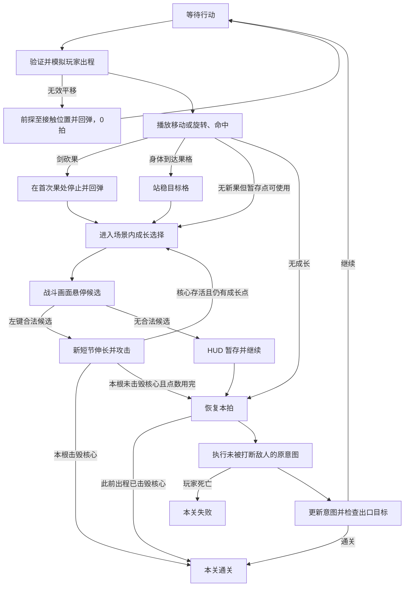

# 《剑会变长》完整开发文档

**目标引擎：团结引擎 1.10.0 · 文档版本：1.12.0 GameJam Release · 日期：2026-09-06**

## 修改履历

| 版本 | 日期 | 记录时状态 | 修改内容 |
| --- | --- | --- | --- |
| 1.12.0 | 2026-09-06 | GameJam 最终发布 | 完成 12 关全流程人工演示与最终资料整理；工程 `bundleVersion` 更新为 `1.12.0`；README 改为面向玩家的项目首页，并新增精简版 CHANGELOG、GameJam 发布说明、封面与玩法截图。重新构建 Windows 64 位包，以 `Growblade-v1.12.0-GameJam-Windows.zip` 发布到 GitHub Releases。 |
| 1.11.3 | 2026-09-06 | 已实现、构建并发布 | 对外英文名定为 `Growblade`。团结工程 `productName`、Windows 产物名和公开仓库构建路径统一为 `Growblade` / `Growblade.exe`；游戏内中文标题《剑会变长》保持不变。无界面 Windows 64 位构建成功，BuildReport 大小 124,969,262 bytes。 |
| 1.11.2 | 2026-09-06 | 已实现、验证并重建 Windows 包 | 首关新手教程的果实说明卡补充“Space 等待，经过一拍。”，明确等待同样推进一拍；随后重新构建 Windows 64 位包。 |
| 1.11.1 | 2026-09-06 | 已实现并构建 | 汇总当前已验收的首关教程、标题退出与署名、弩手三拍节奏、连续关卡解锁及全关确认解锁、最终关结算标题等实现；完成 Windows 64 位构建，产物位于 `Builds/Windows/剑会变长.exe`。 |
| 1.11.0 | 2026-09-06 | 已实现并验证 | 新增关卡解锁进度：首次仅第 1 关可选；完成第 x 关后开放第 x+1 关，进度保存到 PlayerPrefs 并在重启后恢复。选关页将未开放关显示为不可点击的“尚未解锁”。右上角新增“解锁全部”按钮与确认卡。通关最后一关时结算标题为“恭喜你完成了所有冒险”。 |
| 1.10.9 | 2026-09-06 | 已实现并验证 | 标题界面新增“退出游戏”按钮：正式构建调用 `Application.Quit()`，编辑器试玩仅记录退出请求。页面最底部中央新增作者署名“by 海蛋”。 |
| 1.10.8 | 2026-09-06 | 已实现并验证 | 第一关从关卡选择进入后显示简洁的新手教程卡。卡片说明同步回合、WASD 移动、Q/E 转剑、果实触发生长与左键确认，以及本关出口目标；关闭“开始冒险”前不开放回合输入。重试本关不重复弹出。 |
| 1.10.7 | 2026-09-06 | 已实现并验证 | 弩手攻击节奏改为“预备 1 拍 → 射击 1 拍 → 冷却 1 拍”。射击后进入不显示射线、不会伤害玩家的 `Cooldown` 意图；冷却结束后才重新根据玩家位置预备。新增回归测试覆盖完整循环。 |
| 1.10.6 | 2026-09-06 | 已实现并验证 | 关卡编辑器新增默认目标“直接离开”：出口在载入时可见并点亮，玩家进入出口即通关，不检查敌人、核心或机关；新建关卡默认采用此目标。原清敌、机关、组合目标的序列化值与行为保持不变。 |
| 1.10.5 | 2026-09-06 | 已实现并验证 | 新增第 11 关 `ROOM_GrowthCrates`：无敌人、2 枚多生长果（2 / 3）和 1 枚普通果，共 6 次成长预算；两条反向推箱窄道要求分别从下向上、从上向下把箱子压到机关，出口随后出现。布局通过初始短剑静态可达校验。 |
| 1.10.4 | 2026-09-06 | 已实现并验证 | 修正平移碰果语义：仅剑身在平移出程中先触果时才按碰墙轨迹整体回弹；角色身体完整移动到目标果格时，消费果并停在该格后直接进入成长，不再被错误弹回起点。F01 回归用例同步覆盖该边界。 |
| 1.10.3 | 2026-09-06 | 已实现并验证 | 按运行时字形边界测量修正 TMP 世界文字缩放：`2` 原实际仅约 0.03 格，现扩大至约 0.20 格，占计数牌内区一半以上，保证缩小 Game View 下仍可识别。 |
| 1.10.2 | 2026-09-06 | 已实现并验证 | 多生长果计数改用项目 TMP 字体，移除在缩小 Game View 中笔画不稳定的 Legacy `TextMesh`。计数牌扩大为果实正上方的 0.50 格奶油圆牌，数字以深绿粗体居中，果实本体不再被遮挡。 |
| 1.10.1 | 2026-09-06 | 已实现并验证 | 重绘多生长果数字呈现：裸 `TextMesh` 改为固定在果实右上角的奶油圆形计数徽章，使用深绿粗描边与深绿粗体数字；徽章独立于果 Sprite 缩放，避免遮挡果实或产生巨大、模糊的数字。 |
| 1.10.0 | 2026-09-06 | 已实现并验证 | 新增多生长果：关卡资产以 `growthValue` 表示，`1` 为普通果、`2–9` 为显示数字的多生长果。拾取或砍到多生长果后获得对应数量的成长点，并在所有点数用完前强制保持成长阶段，不能通过“暂存成长”进入下一拍或继续行动。编辑器新增“多果”画笔、默认次数设置、数值预览与选中果的次数编辑；校验和预算按实际成长次数计。 |
| 1.9.3 | 2026-09-06 | 已实现并验证 | 箱子可见尺寸由 0.90 格微调为 0.85 格；裁切后的 Sprite 边界保持不变，因此视觉和配置尺寸一致。机关维持 0.92 格。 |
| 1.9.2 | 2026-09-06 | 已实现并验证 | 修复箱子“配置为 0.90 格但肉眼偏小”：原始透明 Sprite 的可见箱体仅占画布约 68.8%，导致视觉实际约 0.62 格。已按手绘描边的可见 Alpha 边界裁掉透明留白，保留原 `Box_v1.png` 资源路径和引用；运行时可见箱体现与 0.90 格配置对应。 |
| 1.9.1 | 2026-09-06 | 已实现并验证 | 身体上下左右移动踏到果格时，果被消费后不再停留在目标格：角色和剑完整前探到果格、沿原路回弹至起点，再进入生长；仍只结算一拍、敌人阶段仍在成长确认或暂存后续完。箱子 / 机关运行时显示尺寸分别增至 0.90 / 0.92 格。 |
| 1.9.0 | 2026-09-06 | 已实现并验证 | 关卡目标收敛为编辑器中的“清除敌人”“打开机关”“清敌＋机关”：核心与普通怪统一计入清敌条件，核心死亡不再立即胜利，所有目标均需最后进入出口；组合目标须同时清除核心 / 普通怪并使全部箱子压住机关。旧 `DestroyCore` 资产自动按清敌目标读取。编辑器玩家预设改为玩家格＋正前方一格剑身占位，第二、第三前方格恢复可编辑；放置与旋转会按东南西北检查该剑身格。94/94 EditMode 通过。 |
| 1.8.2 | 2026-09-06 | 已实现并验证 | 依据实机反馈重绘箱子与机关：删除木纹、铆钉、机械边角等细节，统一为深绿粗手绘轮廓与少量暖色块；箱子仅保留方形轮廓和 X 撑条，机关仅保留圆角底座和中央按面。运行时占格直径分别由 0.66 格增至 0.78 格、0.80 格，提高小尺寸辨识度。 |
| 1.8.1 | 2026-09-06 | 已实现并验证 | 替换箱子和机关的纯色占位。`Box_v1.png` 为带深绿手绘描边、暖木色交叉木板的普通推箱子木箱；`PressurePlate_v1.png` 为绿色底座上的琥珀按钮。二者以透明单 Sprite 导入并绑定 `GameConfig`，机关排序在箱子下方，保留被箱子压住时的辨识度。运行时资产绑定检查通过。 |
| 1.8.0 | 2026-09-06 | 已实现并验证 | 平移时身体撞墙、越界或剑身碰墙不再作为零拍拒绝：按首次安全进度前探、回弹至原格、提交 1 拍并执行敌人阶段；身体目标被角色占据仍拒绝。新增 `PushBoxesToPlatesAndExit`：箱子不受伤、不自行行动，可被平移剑、旋剑和成长边按普通击退方向推动，遇墙 / 角色 / 其他箱子停留；全部箱子一一占住机关后出口出现并点亮，玩家进入出口通关。编辑器增加箱子 / 机关画笔、选择、移动、删除、缩图清理、数量与落点校验。89/89 EditMode 通过。 |
| 1.7.15 | 2026-09-06 | 已实现并验证 | 按实际布局复现角色贴近右下墙向下移动：1.4 格中心线加 0.1 格剑半径会接触墙并回弹；初始尖段由 0.4 缩为 0.3 格，最大触及改为 1.3 格，使该动作可完整执行。后续每根成长仍严格为 0.5 格。形状基线更新为 1/7/42/235/1276/6813，累计 8374。 |
| 1.7.14 | 2026-09-06 | 已实现并验证 | 初始剑身改为 0.5 格根段 + 0.4 格尖段，最大触及从 1.5 缩为 1.4 格。剑图内部节点升级为 0.1 格整数单位，碰撞、旋转、预览和渲染共用；后续每根成长仍严格为 0.5 格（5 单位）。为防止 0.5 格候选跨过 0.4 格尖段的已有结点，候选生成拒绝跨结点边。形状基线更新为 1/7/42/235/1278/6839，累计 8402。 |
| 1.7.13 | 2026-09-05 | 已实现并验证 | 结算统计调整为两行文案：“行动了 X 拍”与“剑身最长长度 X.X 格”。 |
| 1.7.12 | 2026-09-05 | 已实现并验证 | 结算卡战败标题改为“人被杀，就会死”；胜利与战败统计统一精简为一行，仅显示拍数和最长长度。 |
| 1.7.11 | 2026-09-05 | 已实现并验证 | 精简关卡选择页：移除顶部 `GROW` 装饰字样及关卡卡片的地图尺寸，仅展示关卡编号、名称和果实数量。 |
| 1.7.10 | 2026-09-05 | 已实现并验证 | 编辑器最小宽高改为 2；尺寸校验同步支持 2–31。2×2 可用于搭建或裁切草图；因格子全为边界墙，仍会由出生、目标等常规关卡校验阻止试玩。 |
| 1.7.9 | 2026-09-05 | 已实现并验证 | 关卡编辑器尺寸按钮统一改为“宽±1 / 高±1”，适合逐格微调；保留最小 5×5、缩小前越界清理确认和边界墙重建。 |
| 1.7.8 | 2026-09-05 | 已实现并验证 | 编辑器将 `goalText` 明确为战斗 HUD 左侧“这一关的目标”下方的多行说明；新增每个 `RoomDefinition` 独立的 `initialPlayerHp`。运行时开局、重试和 HUD 心形均按本关生命读取；旧资产的 0 值兼容为 GameConfig 默认生命，新建关默认显式写入 4。新增生命解析回归测试，运行时验证 6 心与多行目标文本通过。 |
| 1.7.7 | 2026-09-05 | 已实现并验证 | 关卡编辑器新增“宽-2 / 高-2”，最小尺寸为 5×5；缩小前预览越界的果、敌人、主出生、核心、出口，作者确认后才清理，随后重建边界墙并取消越界选中。同步修复“高+2”实际仅增长 1 格。新增缩图数据回归测试并完成编辑器模式验证。 |
| 1.7.6 | 2026-09-05 | 已实现并验证 | 旋剑首次接触普通敌人或核心时，先结算一次伤害 / 击退，再按该接触进度回弹并保持原朝向；平移攻击不变。战斗 HUD 移除左上品牌块与底部 Shift 预览文案。新增 T07 敌人回弹回归测试，运行时验证回弹、单次伤害与 HUD 清理均通过。 |
| 1.7.5 | 2026-09-05 | 已实现并验证 | 修复核心关清空普通守卫后误显示“房间已清理：前往出口继续”。`RoomCleared`、出口点亮与该提示现在仅属于 `ClearEnemiesAndExit`；`DestroyCore` 关必须击毁存活核心才可通关。新增两项目标边界回归测试，并完成运行时验证。 |
| 1.7.4 | 2026-09-05 | 已实现并验证 | 游戏正式名称统一改为《剑会变长》：更新标题界面、HUD 品牌、团结编辑器菜单、构建产品名与文档标题。`sdnf_*` PlayerPrefs 和 `SDNF_*` SessionState 键保留，以兼容已保存的本地设置与试玩会话。 |
| 1.7.3 | 2026-09-05 | 已实现并验证 | 精简标题界面：移除顶部 `GROW`、左上“一拍一动 / 一节一长”、开始按钮下方两行操作说明和底部 `GROW / 剑格不入`；保留标题、核心标语、开始按钮、装饰植物与右侧玩法示意卡。运行时对象检查无残留，最终画面已复核；关卡选择界面的顶部标记不受影响。 |
| 1.7.2 | 2026-09-05 | 已实现并验证 | 新增独立 `PlayerMove` 音效，玩家平移不再误用刺耳的 `BladeSwing`；胜负乐句改用独立 AudioSource，载入关卡或返回选关时停止，同时结束 BGM duck，且不截断普通短音效。EditMode 79/79；运行验证脚步 2 变体、过关乐句启动 / 停止、BGM 压低 / 恢复及短音效保留均通过。 |
| 1.7.1 | 2026-09-05 | 文档已更新 | 新增第 20 节“原始素材、来源与授权”，逐项记录正式美术、程序生成图形、音乐、音效、字体、派生资产和历史占位素材；补充授权条件、随包文件、Game Jam 发布署名范本和发布前检查表。 |
| 1.7 | 2026-09-05 | 已实现并验证 | 接入 130.17 秒固定循环 BGM 与 11 类事件音效（22 个短音频文件），高频事件支持 2–3 个变体顺序轮播并带轻微音高变化；补齐胜利 / 失败统一触发、结算 BGM 自动压低，8 路 SFX 并发池避免同拍命中截断。暂停菜单音乐 / 音效滑条分别实时控制两路音量并由 PlayerPrefs 持久化。全量 EditMode 79/79，运行态 11/11 触发、循环、滑杆、混音压低 / 恢复均通过。全部采用 CC0 素材，来源、映射与许可见 `Assets/_Game/Audio/THIRD_PARTY_AUDIO.md`。 |
| 1.6.2 | 2026-09-05 | 已实现并验证 | 修复关卡编辑器已有果 / 怪物删除后提前返回，导致未标脏且未重绘的问题；修正实体画笔在合法地面仍显示红色。补全选择工具：选中高亮、右键 / Delete / 按钮删除、坐标移动、怪物类型、fruitId 与玩家朝向编辑，均支持 Undo。75/75 测试通过；临时资产完成编辑→删除→保存→强制重载，内容一致且无硬错误；一键试玩直接载入当前关，停止后恢复编辑器。 |
| 1.6.1 | 2026-09-05 | 已实现并验证 | 冲锋怪由“只尝试立即接近的两个方向”改为 BFS 最短路追击。墙、存活怪物和剑身胶囊扫掠范围均为障碍；会从剑尖 / 剑柄侧面绕行，仅在不存在可达路线时等待。同长度路线按 actorId 固定取舍，保持意图可预测。新增绕行与无路可走测试，共 67/67；运行验证四拍从剑前绕至侧面攻击。 |
| 1.6 | 2026-09-05 | 已实现并验证 | 敌人自主移动增加剑身连续碰撞：规划与执行双重检查，包含半格分支、当前朝向和途中穿越。受阻平移改为接触前探 / 回弹；不提交拍事务、不攻击或拾果，不弹普通无效提示。新增 8 项测试，调整 2 项允许穿剑的旧用例，共 65/65；9 关校验通过。运行验证暂停冻结、连按隔离、归位与重试取消。录像 artifacts/collision/collision-and-bump.mp4。 |
| 1.5.1 美术 | 2026-09-05 | 已实现；整体风格已验收 | 统一手绘花园素材与全套 UI，修复暂停音量滑条，墙面去除三角纹路，地面统一底色和轻微格线阴影。玩法沿用 v1.4；本行与 [美术接入说明](art-direction-garden-v1.5.md) 覆盖旧版像素美术描述。 |
| 1.4 | 2026-09-05 | **已实现并验证**（运行时 + 编辑器） | 生长改为战斗主画面原位悬停预览、鼠标左键确认（WorldGrowthOverlay 替换 GrowthPreview 的 RT / RawImage / GrowthPanel；Space / Enter 不再确认，MouseUp 门闩 + 同帧候选不提交）；新增短节伸长期间伤害 / 击退 / 本拍意图打断（GrowthSimulator 首次接触二分 + CombatRules 语义 + growthActionId 逐根事务，敌人 / 核心不再阻止候选）；移除全局果数 / 成长次数 / 剑边数硬上限（TrajectorySolver 动态容量、RoomValidator 果数改 Info、HUD 去 x/7）。验证：EditMode 57/57（原 43 + 新增 14：A 系列伸长攻击、U 系列 6/12/24 无上限、26 边求解器、账本等式）、9 关校验 PASS、Play 实测身体拾取→世界悬停→左键伸长→命中击退→打断敌人续拍（GIF 记录 Temp/v14_growth_attack.gif）、8 连生长 + 伸长中暂停恢复 + 重试重置、Console 零错误。Windows 未构建；编辑器 P1 / 作者指定形状复核 / 完整解谜 / E01–E13 人工全流程仍未完成。 |
| 1.3 | 2026-09-05 | **已实现并验证**（M0–M5 完成） | 生长改为房内碰果 / 砍果触发；剑先完整回弹再开成长，成长后续完同一拍敌人响应。每关短剑开局、通关 / 重试重置，移除出口成长与跨关继承。保留 1.1 自由短节与 1.2 鼠标预览 + Space；补无位置暂存默认规则、独立关目标、资产迁移、关卡编辑器完整规格、实施顺序与验收用例，并增加给 Tuanjie AI 的交接文件。实现：SwordState 边图迁移（7538 形状基线测试一致）、果截断 / 回弹 / 分段拍事务（BeginPlayerAction / ResumeEnemyPhase）、LoadLevel 独立关重置、Level Editor（画笔 / 校验 / 试玩桥）；EditMode 43/43、9 关校验 PASS、3 内容关实际通关。 |
| 1.2 | 2026-09-05 | 当前目标规格，待同步实现 | 成长交互改为「鼠标悬停生长位置 → 原位显示新剑节预览 → 按 Space 确认」；替换结点点击、方向键选择和 Enter 确认。补充候选吸附、无效位置、预览图层、输入隔离及验收用例；本次已检查文档一致性，运行时代码尚未迁移。 |
| 1.1 | 2026-09-05 | 当前目标规格，待同步实现 | 将「主刃伸长 / 三个固定芽槽」改为火柴式自由生长：每次固定增加一根 0.5 格剑节，可从任意已有结点向四个正交空方向生长；补充选择交互、合法性约束、全形状去重验证、测试和迁移清单。 |
| 1.0 | 2026-09-05 | 已实现基线 | 固定主刃伸长与 Root→Middle→OldTip 侧芽；完成同步回合、连续碰撞、回弹、敌人、六房流程和构建规格。 |

每次修改先在本表最上方追加履历，保留旧记录并区分“文档目标”与“已实现”。旧行中的“当前”“完成”指记录当时的口径，不能覆盖最新状态。

> **最终状态：** 《剑会变长》/ Growblade v1.12.0 为本次 GameJam 发布版，共 12 个关卡。已完成人工全流程录像，包含连续解锁、首关教程、自由剑身生长、同步回合战斗、数字多生长果、箱子机关、弩手与最终核心关。运行时中文标题保持《剑会变长》，Windows 产品名为 Growblade。关卡编辑器 P1、缩略图和完整自动解谜器保留为赛后扩展，不影响发布版游玩。

开发 agent 先阅读 [v1.4 开发交接指令](tuanjie-ai-v1.4-handoff.md)。本文件为最新完整规则，旧 v1.3 交接仅作历史参考。第 1.2 节区分用户需求与补齐边界的默认值，第 4–5 节定义成长交互和攻击，第 19.9 节定义编辑器本轮增量。

## 目录

1. 项目目标与本轮范围
2. 在现有团结引擎工程上继续开发
3. 操作、坐标和尺寸
4. 一拍、果、场景内生长和敌人响应
5. 武器结构与成长
6. 连续碰撞与轨迹算法
7. 动画、命中反馈与预览
8. 敌人、伤害和核心目标
9. 独立关卡与重置流程
10. v1.4 程序结构与事务契约
11. 场景、表现和资产组织
12. UI、教学、美术与音频
13. 基于已完成 v1.3 的实施顺序
14. v1.4 验收与回归
15. 构建、提交与交接
16. 风险、裁剪与后续扩展
17. 参数总表与规则索引
18. 官方资料与版本说明
19. Tuanjie AI 关卡编辑器开发规格
20. 原始素材、来源与授权说明

## 1. 项目目标与本轮范围

### 1.1 当前核心循环

**单个关卡 = 一个独立房间。以最短剑开始，在房内碰到或砍到“果”获得成长机会；直接在战斗画面点击合法位置，让新剑节在场景中长出并击退沿途敌人，最后完成关卡目标。下一关重新从短剑开始。**

保留已经完成的 v1.3 核心：俯视 2D、玩家行动一拍世界行动一拍、四向平移、Q/E 转剑 90°、真实接触回弹、出程伤害与击退、任意结点添加固定 0.5 格短节、房内果、分段拍事务、独立关重置和关卡编辑器。

v1.4 只修改成长选择与成长攻击，并解除成长次数硬上限。多房间联通、跨关武器继承、编辑器 P1 和完整解谜求解器仍是后续内容。

### 1.2 本轮确定规则与实现默认值

| 类型 | 规格 |
| --- | --- |
| 用户确定 | 生长确认改为鼠标左键点击 |
| 用户确定 | 生长时不弹出独立预览窗口；候选和预览直接显示在当前游戏画面 |
| 用户确定 | 点击对应合法位置后，新短节在原位置开始伸长 |
| 用户确定 | 伸长过程中碰到怪物触发正常攻击与击退 |
| 用户确定 | 生长不设全局上限；每关实际可成长次数由关卡编辑器中果的数量控制 |
| 沿用 v1.3 | 每个果只提供 1 点成长；每点添加一根固定 0.5 格短节 |
| 本文默认 | 成长攻击伤害、普通击退、撞墙附伤和打断规则复用普通剑命中 |
| 本文默认 | 成长攻击的击退方向为新短节从锚点指向新端点的世界四向方向 |
| 本文默认 | 核心可被成长攻击伤害但不击退；其胜负顺序沿用普通剑击毁核心 |
| 本文默认 | 敌人和核心不再使候选非法；墙、边界、玩家、自身重叠、未收集果仍会使候选不可选 |
| 本文默认 | 只由新增短节首次覆盖的区域攻击；已与旧剑重叠的目标不会因从同一锚点长出而在进度 0 重复受击 |
| 本文默认 | 暂存兜底保留，显示为战斗 HUD 上的轻量提示 / 按钮，不弹出预览面板 |
| 用户确定（v1.8） | 平移撞墙或剑碰墙会前探回弹，仍消耗一拍并执行世界响应 |
| 用户确定（v1.8） | 箱子可按敌人击退方向被剑推开，但不会自行移动；全部箱子压住对应机关后出口才显示 |

### 1.2.1 箱子机关规则（v1.8）

- 目标类型为 `PushBoxesToPlatesAndExit`；箱子数必须等于机关数且至少各一个。
- 箱子是不可破坏的动态占位物，不计入普通敌人清理目标，不生成行动意图。
- 平移剑、旋转剑及新剑节伸长均可推动箱子 1 格；方向与同类敌人击退一致。
- 箱子目标格为墙、边界、玩家、敌人、核心或另一箱子时保持原位，不受撞墙伤害。
- 旋剑首次碰箱子与碰怪一致：推动一次后回弹。平移剑保持原有前进攻击规则。
- 机关始终显示在地面；出口在全部箱子分别占住全部机关前隐藏，达成后出现并点亮，玩家身体进入出口即通关。

这些默认值让开发 agent 可以直接实现。若试玩后改变击退方向、核心可受击性或暂存方式，先更新本页修改履历和第 14 节测试。

### 1.3 本轮交付

| 内容 | v1.4 最小交付 |
| --- | --- |
| 场景内成长 | 当前战斗画面显示所有合法候选、鼠标悬停高亮、左键确认 |
| 成长攻击 | 新短节从锚点向外伸长，按动画进度触发伤害、击退和意图打断 |
| 规则解除 | 删除运行时与编辑器中的 5 果 / 7 剑节硬上限 |
| 关卡工具 | 果画笔可放任意数量；只给性能提示，不阻止保存或试玩 |
| 回归 | v1.3 的移动、转剑、砍果回弹、同拍敌人续完、重置和 3 个内容关保持可用 |
| 范围外 | 编辑器 P1、完整自动解谜、Windows 打包、多房联通 |

### 1.4 设计验证重点

- 玩家从果触发到选择生长期间始终看见原房间、角色、敌人、果和剑，不发生镜头切换或遮屏。
- 候选必须直接覆盖在它真正会长出的世界位置，点击反馈与最终几何一致。
- 敌人站在候选路径上时，该候选应明确提示会命中，而不是变成非法红色。
- 生长攻击属于同一拍的玩家阶段；被击中的普通敌人取消本拍意图，其他敌人在全部成长处理结束后各响应一次。
- 关卡作者通过果数量控制本关成长预算，系统不再偷偷截断第 6 次及以后的成长。
- 1.3 的 43 项测试和 3 关通关是已完成基线，不等于 v1.4 已实现。

## 2. 在现有团结引擎工程上继续开发

### 2.1 已核对的工程基线

| 项目 | 本地现状 |
| --- | --- |
| 编辑器 | `ProjectSettings/ProjectVersion.txt`：团结 1.10.0，2022.3.62t12 |
| 渲染 | 已有 URP；manifest 中为 `14.2.0-t1` |
| 场景 | `Assets/_Game/Scenes/Game.scene`，运行时构建房间和 UI |
| 主运行程序集 | `SwordGame.Runtime`；代码在 `Assets/_Game/Scripts/` |
| 房间配置 | `RoomDefinition` 的墙格、出生、敌人、核心、出口数据 |
| 关卡列表 | `RunDefinition.stages`；已用于独立关卡列表 |
| 当前成长代码 | `SwordState.edges` 自由边图；现有成长预算限制需解除 |
| 当前操作 | v1.3 使用悬停 + Space 确认，独立相机 / RenderTexture / RawImage 预览；v1.4 改世界内左键 |
| 当前验证器 | 已有 RoomValidator 和 Level Editor P0；移除果数硬限制并保留结构 / 几何检查 |
| 资源 | 手绘花园角色 / 地块、TMP 中文字体；v1.7 已接入 CC0 音乐与音效 |

**直接修改现有工程，不重新建项目，也不把 URP 改回内置管线。** 本文用 `Game.scene` 指本地实际资源；不要按旧文档创建另一份 `Game.unity`。

团结引擎官方说明以 Unity 2022 LTS 为研发基础；本文的 EditorWindow、ScriptableObject 等采用该代基础能力。实际版本以本地工程和编辑器为准。[团结引擎手册](https://docs.unity.cn/cn/tuanjiemanual/Manual/)

### 2.2 工作约束

1. 先阅读根 README、CODELY.md 和本文件；建立当前 bug 与基线测试记录，不覆盖原记录冒称已通过。
2. 保留现有 asset / meta / GUID、材质、字体、URP 资源和场景引用。按第 19 节为房间做显式数据迁移。
3. `RoomDefinition` 是关卡内容的唯一数据源，编辑器修改配置资产，运行时只读配置并复制出状态。
4. `Assets/_Game/Editor/` 内代码编入仅 Editor 的程序集；玩家构建不能依赖 UnityEditor。
5. 不升级引擎、包或接入新的第三方补间 / 地图编辑器。新增中文 UI 文本进入现有字体覆盖范围。
6. 按模块增量完成并验证；不把新玩法、编辑器和旧碰撞 bug 全部混在一次无法回归的大改动中。

### 2.3 保留的运行参数

世界格 1.0，XY 平面，相机正交；参考分辨率 1280×720；UI 使用现有 uGUI + TMP；输入仍可用经典 Input，但必须先按状态分派。逻辑由确定性求解器驱动，Transform 和 Coroutine 只负责表现。常规开发验证以 EditMode / Play 与现有三关回归为主；Windows 在交付前再按第 15 节执行。

沿用已有目录，按第 5.7 节修改现有文件；文档入口：

```text
Assets/_Game/
  Scripts/Core/             分段一拍事务、独立关卡重置
  Scripts/Growth/           边图、候选、房内放置校验
  Scripts/World/            FruitState / FruitResolver（也可按现有结构放 Core）
  Scripts/Presentation/     FruitView、房内上下文成长预览
  Editor/LevelEditor/       EditorWindow、画笔、资产操作、试玩桥接
  Tests/EditMode/           果事件、重置、编辑器数据测试
Assets/docs/
  sword-does-not-fit-development-tuanjie-1.10.0.md
  tuanjie-ai-v1.4-handoff.md
```

`ScriptableObject` 类与文件保持同名，避免现有工程曾出现的资产脚本绑定问题。

## 3. 操作、坐标和尺寸

### 3.1 操作表

| 输入 | 战斗状态 | 是否消耗一拍 |
| --- | --- | --- |
| W / ↑ | 人与剑整体向上平移 1 格 | 合法时消耗 |
| A / ← | 整体向左平移 1 格 | 合法时消耗 |
| S / ↓ | 整体向下平移 1 格 | 合法时消耗 |
| D / → | 整体向右平移 1 格 | 合法时消耗 |
| Q | 剑逆时针尝试转 90° | 总是消耗，包括撞墙回弹 |
| E | 剑顺时针尝试转 90° | 总是消耗，包括撞墙回弹 |
| Space | 等待，剑不攻击；成长阶段忽略 | 战斗中消耗 |
| 鼠标左键 | Growing 状态确认鼠标指向的合法生长候选 | 不额外耗拍 |
| Esc | 打开 / 关闭暂停菜单 | 不消耗 |
| Shift + 行动键 | 按住查看该行动的预览，松开不执行 | 不消耗 |

进入成长选择状态后，战斗画面保持原样并冻结逻辑；全部合法候选直接叠加在剑的实际世界位置。将鼠标移到某条候选上会显示半透明新节及预计命中目标，按鼠标左键确认并立即播放伸长。无需弹出窗口，也不使用 Space、Enter、Q/E 或 WASD 提交成长。失败界面提供「重试本关 / 选择关卡」；通关界面提供「下一关 / 重试本关 / 选择关卡」。暂停菜单提供「重试本关」，重试不跳回关卡列表第一关。

Space 始终只在战斗 AwaitInput 状态表示等待并消耗一拍；Growing / PresentingGrowth 状态忽略 Space 和战斗行动键。鼠标左键仅在 Growing 且指针位于合法世界候选上时确认；点击 HUD、暂停按钮、画面空白或非法候选均不提交。进入成长状态前用于触发屏幕行动按钮的那次鼠标按下不能透传为成长确认，至少要求一次 MouseUp 后才接受新的 MouseDown。

一次按下只接收一条指令，动画中不缓存输入、不连续重复按键。战斗键同帧采用固定优先级 `W、A、S、D、Q、E、Space`。Growing 时屏蔽这些键；指针在 EventSystem UI 上时不执行世界候选点击。经典输入的 `GetKeyDown` 应在 `Update` 中读取：[官方 API](https://docs.unity3d.com/2022.3/Documentation/ScriptReference/Input.GetKeyDown.html)。

### 3.2 三种尺度

| 对象 | 默认规格 | 含义 |
| --- | --- | --- |
| 世界格 | 1.0 世界单位 | 人、敌人、墙的逻辑定位 |
| 玩家 | 可见直径 0.60；受击半径 0.28 | 身体占一个格位，画面保留留白 |
| 普通敌人 | 可见直径 0.60；受击半径 0.30 | 视觉与受击区基本一致 |
| 剑 | 碰撞宽 0.20；外轮廓宽约 0.22 | 连续细刃，无整格剑块 |
| 生长 | 每个果新增 1 根长 0.50 的中心线短节 | 无全局次数上限；关卡果数量决定本关上限 |
| 初始最大触及 | 轴心到最远结点 1.30 | 下文 `maxReachRadius` 的定义 |
| 最大可能触及距离 | 随本关果数增加 | 无固定 4.0 上限，实时从当前边图计算 |
| 最大几何半径 | 从轴心到所有端点的最大距离，再加剑半宽 | 碰撞和镜头以实际图形计算 |

UI 使用「最大触及 1.3 格」和「总节数 2」，不再使用只有单一直刃才成立的 tipDistance。角色中心是旋转轴；护手约在前方 0.3 格；有效初始剑身从局部 `(0.5,0)` 到 `(1.3,0)`，由 0.5 格根段与 0.3 格尖段组成。护手和握柄是装饰，不另有伤害体。最大触及 `maxReachRadius` 始终从全部结点到原点的最大距离计算。

### 3.3 世界和武器坐标

- 棋盘坐标 `cell = (x,y)` 用 `Vector2Int`，X 向右、Y 向上。
- 房间 Grid 未变换时，格心世界坐标为 `(x+0.5,y+0.5)`。现有 RoomView 与编辑器统一调用 BoardModel 的格心转换，不要求新增 Tilemap；禁止同时再加一次 0.5。
- 剑的局部节点用**0.1 格整数坐标**保存：`(13,0)` 表示局部 `(1.3,0)` 世界单位。字段名 `aHalf/bHalf` 仅为旧资产兼容，不再表示半格。
- 初始剑由 `(5,0) → (10,0)` 的 0.5 格根段和 `(10,0) → (13,0)` 的 0.3 格尖段组成；成长每次新增一条长度恰为 5 单位、即 0.5 格的边。
- 固定朝向约定为 `East=0, North=1, West=2, South=3`，世界角为 `facing*90°`。
- Q 逆时针角为 `+90°`，E 顺时针角为 `-90°`。这与浏览器 SVG 的 Y 向下坐标不同，移植预览时必须翻转符号。
- 两拍之间用整数朝向还原旋转，禁止从 Transform 浮点角度反推逻辑朝向。

任意动画时刻的节点位置：

```text
worldPoint(u) = pivot(u) + Rotate(facing*90° + deltaAngle*u, node*0.1)
u ∈ [0,1]
```

平移时 `deltaAngle=0`；旋转时 `pivot(u)` 不变。

## 4. 一拍、果、场景内生长和敌人响应

### 4.1 状态流程



Growing 只是输入与逻辑暂停状态，不是独立画面：主相机、房间、角色、敌人和剑保持当前位置，HUD 仅增加提示与候选覆盖。不得启用旧 GrowthPanel、独立 PreviewCamera、RenderTexture 或 RawImage。

一次玩家指令只创建一个 PendingBeat。果触发、一个或多个暂存点的连续生长、成长攻击和敌人响应都属于这一个事务；beatIndex 只增加一次。

### 4.2 指令验证和耗拍

| 情况 | 判定 |
| --- | --- |
| 身体目标是墙或地图外 | 前探至安全接触点后回弹，消耗 1 拍、0 伤害、0 果，敌人阶段继续 |
| 身体目标在行动开始时有敌人 / 核心 / 箱子 | 拒绝输入，0 拍，避免身体与动态占位物重叠 |
| 完整一格平移路径上身体或剑会撞墙 | 前探回弹并消耗 1 拍；即使墙前有果也不触发 |
| 完整平移合法，出程剑先碰果 | 在果处截断并整体退回，消耗 1 拍 |
| 合法平移未被剑砍果截断，目标格有果 | 身体完整前探到果格、拾取并停在该格，再进入生长；消耗 1 拍 |
| Q/E 旋转 | 碰墙或砍果可提前回弹，消耗 1 拍 |
| Space 等待 | 消耗 1 拍；静止剑不攻击、不收集果 |
| 悬停、左键确认成长、成长动画、暂存 | 不额外耗拍；本拍仍欠敌人一次响应 |

### 4.3 果与成长点

果是格心上的单次资源。fruitId 在本关唯一；首次有效收集设 consumed。普通果 `growthValue=1`，增加 1 点可暂存成长；多生长果 `growthValue=2–9`，在果面显示数字、增加对应点数，并把这些点标记为必须连续完成。只要仍有强制点，玩家不能暂存、不能进入敌人续拍或下一次行动；每点仍添加一根固定 0.5 格短节。

**运行时和编辑器均不设置果数量 / 生长次数上限。** 关卡作者放多少果，本关最多就能获得多少成长点。允许 0 果。HUD 显示“剩余果 / 暂存成长”，不显示“总节数 x/7”。

初始果不得与墙、玩家、敌人、核心、出口、其他果或初始剑重叠。敌人后来可经过果格但不收集；箭和核心脉冲不触发果。新短节不得碰未收集果，避免一次生长连锁消费另一果。

每关仍满足：

```text
已消费果数 = growthCount + growthCredits
edges.Count = 2 + growthCount
growthCount >= 0
```

等式右侧没有常量上限。换关 / 重试清空本关成长数据。

### 4.4 身体碰果和剑砍果

身体碰果按“合法移动最终到达果格”识别：角色完整前探到果格、消费果并停在该格，随后进入场景内成长选择。若剑更早碰到果，整次平移按剑砍果处理，人与剑一起回到原格，并取消目标格身体拾取。

旋转剑砍果时，在首次果接触处停止，播放反馈，再沿原轨迹回到起始角。平移剑砍果时，人与剑一起退回出发格。果之前发生的伤害、击退和意图打断保留；回程不攻击、不取第二个果。完全归位后才显示世界候选并解锁成长左键。

墙 / 果 / 多果 / 敌人的接触优先级：

1. 完整平移墙验证先于所有事件。
2. 可执行轨迹中比较墙与果的首次接触，误差区间重叠时墙优先。
3. 多果取最早，平局按稳定 fruitId，只消费一个。
4. 平移中，敌人必须严格早于截断区间才受击；截断点后的敌人不受击。
5. 旋转中，最早接触的敌人 / 核心也会成为截断点：先结算该目标的一次伤害 / 击退，再沿原弧线回弹；与墙接触误差重叠时墙优先，和果接触误差重叠时果优先。
6. 身体拾果位于进度 1，仅在没有更早剑果事件时执行。

### 4.5 场景内成长选择

果处理完毕且玩家归位 / 落格后：

1. 冻结敌人逻辑和原意图，保持战斗主相机。
2. 从当前 SwordState 枚举图候选，再按实际 player cell/facing 与房间几何过滤。
3. 在真实世界位置绘制低对比度候选。鼠标悬停合法候选时显示半透明新节、端点和预计受击敌人。
4. 左键按下时锁定当前已经显示的同一候选；重新校验版本后进入 PresentingGrowth。
5. 新节从锚点到端点伸长，按进度触发攻击事件；动画结束后提交最终边图与战斗结果。
6. 若仍有 growthCredits，重新枚举候选并继续选择；否则恢复同一 PendingBeat 的敌人阶段。

候选和鼠标命中使用主相机 ScreenToWorldPoint，再变换到剑局部半格坐标。不能使用旧预览相机的局部朝东模型。候选与最终剑拥有相同 player cell/facing，因此无需为了 UI 旋转房间上下文。

鼠标左键确认规则：

- 只监听 Growing 状态的新 MouseDown；进入状态后必须先观察到 MouseUp。
- EventSystem 判定指针位于 HUD / 菜单 UI 时不做世界选择。
- 点击空白、旧剑、结点死区、墙内或非法方向无效果，保持 Growing。
- 同帧悬停发生变化时，先更新可见预览；若本帧候选不是上一渲染帧已经展示的候选，则本次点击不提交，防止点到未见结果。
- 确认后锁输入，直到该短节及全部命中 / 击退表现完成；长按不会连续添加。
- 暂停会清空悬停，恢复 Growing 后必须重新悬停和点击。

### 4.6 候选合法性与敌人例外

候选必须满足图规则，并且完整最终新边：

- 不碰墙、不越界、不穿玩家身体。
- 不与已有结点 / 边重合，不闭环，保持固定 0.5 格。
- 不碰任何未收集果。
- 可与存活普通敌人或核心相交。相交表示“成长将攻击”，不是非法。
- 死亡敌人不参与攻击目标或候选提示。

若图合法候选被墙 / 玩家 / 果全部挡住，HUD 显示“当前空间不足，成长已保留”和“暂存并继续”。这只是轻量覆盖，不弹出预览窗口。有合法候选时不提供主动跳过。暂存后续规则沿用 v1.3：之后有效玩家行动结束、敌人响应前发现可放置位置时再进入 Growing；没有新果且仍无候选时不重复弹提示。

### 4.7 伸长攻击的精确规则

确认候选边 `A → B` 后，动画进度 `g ∈ [0,1]` 的新增几何为 `A → lerp(A,B,g)`。使用正式胶囊半径与目标圆求首次接触进度，生成稳定排序的 GrowthHitEvent。

- 只检查新增边逐步占据的区域。若目标在成长开始时已经与旧剑任一边接触，则此次伸长不攻击该目标，防止进度 0 重复伤害。
- 其余目标在新增胶囊首次覆盖时受 1 点剑伤；每次确认每目标最多一次。
- 普通敌人按新边从锚点指向端点的**世界四向方向**击退 1 格。击退撞墙追加 1 伤；撞同伴 / 玩家 / 核心则停留且无附伤，复用第 8.2 节。
- 被成长攻击命中的普通敌人设置 interruptedThisBeat，取消当前 PendingBeat 中已显示的意图。
- 核心受 1 伤、不击退、不打断；若 HP 归零，完成本根生长及其命中表现后通关，清空尚未使用的成长点并取消敌人阶段。
- 同一根边可按首次接触进度、再按 actorId 命中多个目标。前一目标击退后更新工作状态，再解析下一事件的击退占位。
- 新边最终提交，即使被命中的敌人因阻挡仍与它重叠；静止剑不会持续伤害。
- 伸长不伤玩家、不打墙、不取果。墙和果已在候选阶段使位置非法。

成长攻击不是新拍，也不重新生成敌人意图。多个 growthCredits 连续确认时，每根新边各有独立的“每目标一次”命中集合；一名敌人可以被不同成长点再次命中，只要它仍存活且不是在该根开始时已与旧剑重叠。

### 4.8 分段事务、胜负与取消

建议事务顺序：

```text
玩家出程与原有命中
→ 果触发与归位
→ [选择候选 → 伸长攻击 → 提交一节] × 可用成长点
→ 核心死亡则通关
→ 其余未被打断敌人按原意图响应一次
→ 失败 / 出口目标 / 下一拍
```

每次确认都在 PendingBeat 的工作状态上结算，不直接修改关卡资产。敌人响应只能调用一次；成长命中不能使敌人重新瞄准。重试、换关或返回选择递增 sessionId，取消候选、成长动画、命中回调和 PendingBeat。

暂停要恢复准确 phase：Growing 恢复世界候选，PresentingGrowth 恢复或安全完成同一根伸长动画，不能返回 AwaitInput 赠送行动。

## 5. 武器结构与成长

### 5.1 数据模型

剑保存为一棵连接在角色前方的短节图。初始有 0.5 格根段和 0.3 格尖段；每点成长增加一条固定 0.5 格边，系统不设全局总边数上限。结点和边使用 0.1 格整数坐标，因此任意形状在旋转四次后都能精确回到原位。

```csharp
[System.Serializable]
public sealed class SwordState
{
    public List<BladeSegment> edges;
    public int growthCount;          // 非负；与本关已实际使用的成长点一致
}

[System.Serializable]
public struct BladeSegment
{
    public UnityEngine.Vector2Int aHalf;
    public UnityEngine.Vector2Int bHalf;
}
```

初始边固定为 `(5,0)–(10,0)` 和 `(10,0)–(13,0)`。角色到 `(5,0)` 之间是剑柄和护手，不属于可选生长边。每条边在保存时把字典序较小端点放在 `aHalf`，使无向边有唯一表示；形状键把全部规范化边排序后连接。插入顺序仅记录本局成长过程，碰撞遍历、鼠标候选平局排序与形状去重都使用规范化边顺序。

碰撞半径由配置统一提供，首版 `bladeRadius=0.10`。同一组 `edges` 同时喂给 `SwordView`、`TrajectorySolver`、成长预览和关卡验证器。禁止另外维护 `tipHalfUnits` 或芽槽等级，否则渲染与实际碰撞会再次出现两个真值。

### 5.2 火柴式生长规则

一次成长在数据上由「已有结点 + 方向」决定；界面根据鼠标悬停位置同时确定二者，不要求玩家分两步选择。候选边为：

```text
anchor = 任意已有结点
direction ∈ {(5,0), (-5,0), (0,5), (0,-5)}
newNode = anchor + direction
newEdge = (anchor, newNode)
```

候选必须同时满足：

- `anchor` 存在于当前图中，方向恰好是一个正交 5 单位步，即 0.5 格。
- `newNode` 尚不存在；新边只能长向一个全新结点。因此结构保持连通、无闭环。
- 新边与旧边不重合，也不得跨过旧结点。该规则确保 0.5 格候选不会穿过初始 0.3 格尖段的端点。
- 新边的胶囊不得与玩家身体圆相交。按默认半径，线段到原点的距离必须严格大于 `playerRadius + bladeRadius = 0.38`。
- 提交成长时需要 `growthCredits > 0`；图候选生成只看当前结构，不读取次数上限。

```text
初始                 选择中点向上生长

柄◆──●──●           柄◆──●──●
                         ┆
                         ○  ← 半透明候选新结点
```

同一结点最多自然连接四条边；没有合法空方向的结点在选择界面变暗。玩家可以从主刃尖端继续向前，得到传统长剑；也可以从中间结点横向分叉，或从已有分支末端继续转折，形成钩、T、叉、阶梯和局部密集的冠状形。

这仍然是离散造型，不是自由绘制、曲线编辑或软体物理。整把剑在战斗中作为一个刚性图形平移或绕角色旋转。

### 5.3 组合规模和设计价值

| 造型倾向 | 示例做法 | 战斗倾向 | 空间代价 |
| --- | --- | --- | --- |
| 长枪 | 持续接在最远端并保持向前 | 平移攻击远、容易隔位命中 | 旋转半径最大，易被墙截断 |
| T 形 | 从中段向两侧长 | 一次旋转可覆盖相反两侧 | 窄门和贴墙转身困难 |
| 钩形 | 从尖端转 90° 后继续长 | 能绕到轴向目标，容易让侧枝先碰墙 | 回弹角度更难直觉估计 |
| 冠形 | 多次从近柄和中段分叉 | 近身覆盖密，较容易打断多名敌人 | 远端触及没有明显增长 |
| 阶梯形 | 每次从新端点交替转向 | 平移时形成错位扫线 | 四向旋转包络不对称 |

无论形状如何，单关用完 N 次成长时都会新增 0.5×N 格总中心线长度，基础伤害不变。区别来自这些短节位于什么位置，而不是选择「加长度」或「加分叉」两个数值按钮。

按 5.2 的规则离线枚举，限定测试深度为 0–5 时的**唯一形状数**应为 `1、7、42、235、1276、6813`，累计 8374 个；这是有限深度回归基线，不是全部形状或玩法上限。不要在运行时枚举无限后续形状。这些是只考虑剑图与角色避让的离线形状数，未过滤任何房间墙体或实体；用于发现去重或图合法性规则意外变化，不要求对所有形状逐一人工试玩。若实现改变玩家避让半径或合法性约束，需要在修改履历中说明并更新预期数字。

### 5.4 场景内悬停预览与左键确认

玩家吃果 / 砍果归位后，房间原画面保持可见，剑和角色仍在真实位置。战斗 HUD 增加“移动鼠标预览 · 左键生长”；敌人意图保留，行动按钮不可执行。无独立剑预览窗口、遮屏蒙层、复制房间或第二台选择相机。

在实际剑的全部合法候选边上画低对比度虚线，悬停时仅高亮一条：旧剑保持实色、新边半透明、锚点发光、新端点为空心圆。可命中敌人时显示目标外圈和击退箭头；不能击退时显示阻挡标志。点击前绝不改 HP、格位、点数或真实边图。

鼠标从主相机视口映射到棋盘平面，再减去玩家轴心、逆旋转玩家朝向，得到剑局部坐标。相机位置、正交缩放和 viewport 必须参与映射；UI 黑边、视口外、暂停 / 失焦时清空候选。别把 ScreenToWorldPoint 的 z 当棋盘世界 z；可以用屏幕射线与棋盘平面的交点消除深度歧义。

继承候选中心线吸附半径 0.12 格、结点死区 0.08 格、旧剑身排除和稳定边键排序。多条等距候选先比较中点距离，再比较规范化边键；禁止默认选第一个候选。指针离开吸附范围即清空。

场景内 0.5 格的短节比原放大窗口小：悬停线和端点可增加屏幕像素宽度提升可读性，但不扩大真实碰撞。主房间镜头固定；不随候选自动缩放、旋转或搬动剑。大地图应人工核对鼠标可选性，工具不通过限制果数解决显示问题。

| 状态 | 左键结果 |
| --- | --- |
| 指向已显示的合法候选 | 锁定这一根，开始伸长 |
| 候选穿墙 / 越界 / 穿玩家 / 图非法 / 碰未收集果 | 不可确认，说明原因 |
| 候选沿途有敌人或核心 | 可以确认，预览成长攻击 |
| 指针在旧剑、死区、空白、UI 或视口外 | 不确认旧候选 |
| 生长动画 / 击退表现中 | 不缓存、不连点添加 |
| 暂停恢复后 | 重新悬停并等待新的点击 |

输入版本检查与 MouseUp 门闩见第 4.5 节。每次选择只提交当前看得见的同一条边；点击后不重新选择另一个“更近”的候选。

### 5.5 伸长动画、攻击与点数提交

从候选的真实锚点 A 向新端点 B 生长，长度从 0 增至 0.5 格，默认 0.45 秒。只动画新增部分，原剑保持不动。规范化存储可能对调边端点，因此动画和击退方向必须保存原始 anchor/newNode，不能用排序后的 aHalf/bHalf 猜生长方向。

在确认瞬间锁定候选并模拟 GrowthSimulation，返回最终剑、成长点、敌人 HP / 格位 / 打断标记和按进度排序的事件。表现层按真实伸长进度消费事件；触及敌人才播放伤害与击退，不能一点击敌人就飞走，也不能长完后才一次性结算所有反馈。

模型可以在工作副本中预先求出结果，但提交与事件播放只能执行一次。动画和最后一个击退表现结束后，原子提交：加一根、growthCount+1、growthCredits-1、swordVersion+1，同时提交敌人结果。失败 / 版本过期不扣点，重试则丢弃整个旧 session 的工作副本。

普通敌人、核心、多目标与旧剑起始重叠处理严格采用第 4.7 节。成长不会消费果；未收集果使候选非法。无候选时沿用第 4.6 节的 HUD 暂存兜底，保留点数，不能卡死或自动丢弃。

### 5.6 无全局成长上限与关卡预算

删除现有 maxBladeEdges、maxGrowthPerLevel、maxGrowth 等字段对玩法的约束，以及任何 growthCount ≥ 5、edges.Count ≥ 7 之类分支。旧配置资产若保留字段用于反序列化兼容，应标注废弃且不参与逻辑，不通过把 5 改成 99 来冒充移除上限。

本关初始果数 N 是作者给出的资源预算。通常最多可追加 N 根，但受地图几何和玩家选择影响，某些成长可能暂存；“无上限”不表示可以无限免费生长或突破墙体。已有有限地图、不得重合的图规则继续生效。

所有容器、遍历、剑渲染、半径、HUD 和碰撞包围盒按实际 edges 动态计算；最大触及不再假设为 4.0。若果数为 N，全部向外直长的理论触及为 1.5+0.5N，但合法性仍取决于墙和边界。

编辑器允许增加 / 保存 / 复制 / 试玩超过 5 果的关卡。可以报告实际数量和性能建议，不能将未达到某个性能目标作为隐藏成长锁。图枚举回归显式指定最大测试深度 5；对较长剑采用代表性构造测试，不尝试枚举所有深度。

成长后能放得下不保证之后可通关。保留重试本关，关卡作者实测直线和分叉路线。作者指定形状复核与完整自动解谜尚未完成，仍属后续选项，不作为此次改动的前置要求。

### 5.7 从 v1.3 迁移到 v1.4

| 现有系统 | 本轮修改 |
| --- | --- |
| GrowthPlacement | 保留图 / 墙 / 边界 / 玩家 / 果校验，去掉敌人 / 核心使候选非法的分支 |
| GrowthOptions、GameConfig | 去除次数与边数硬上限；枚举器深度参数仅用于测试 |
| GrowthController | 初始无选中，鼠标悬停、左键幂等确认，HUD 去掉 x/7 |
| GrowthPreview、HUDController | 改为世界坐标候选覆盖；拆除旧预览相机 / RT / RawImage 的成长路径和遮屏面板 |
| TurnDirector、RunController | Growing 左键输入门、PresentingGrowth 攻击事务、同拍恢复、取消隔离 |
| 新增或整合 GrowthSimulator | 胶囊逐步伸长的首次接触、CombatRules 伤害 / 击退复用、事件列表 |
| ActionPresenter、SwordView | 新边从 anchor 长到 newNode；按命中进度播受击，等待击退后提交 |
| RoomValidator、LevelEditor、资产操作 | 去掉果数上限与截断；保留无重叠、稳定 ID、Undo / 保存 / 试玩 |
| EditMode / Play 验证 | 保留 0–5 深度形状基线，新增世界点击、伸长攻击、超过 5 次成长回归 |

保持现有房间 schema 和 GUID；本轮无需重做 v1.3 的资产迁移，也不重复开发关卡编辑器 P0。

## 6. 连续碰撞与轨迹算法

### 6.1 碰撞对象与统一定义

| 对象 | 逻辑几何 |
| --- | --- |
| 墙、柱、地图边界 | 固定的轴对齐矩形 AABB |
| 剑的每一段 | 中心线段加半径 0.10 的胶囊形 |
| 敌人 | 格心圆，普通半径 0.30；核心半径 0.40 |
| 果 | 格心圆，半径 0.20；身体拾取另外使用到达格事件 |
| 玩家身体 | 格心占位为主；平移路径额外使用半径 0.28 的圆检查墙 |

沿用现有几何求解器并扩展果目标；剑采用线段胶囊距离，不能退回沿剑身少量采样点。动作由逻辑驱动，不交给刚体碰撞反弹。

### 6.2 基础距离函数

纯函数放在 `Geometry2D.cs`，与场景组件分离：

```text
PointSegmentDistanceSquared(point, a, b)
SegmentsIntersect(a, b, c, d)                 // 含端点、平行、共线退化
SegmentSegmentDistanceSquared(a, b, c, d)
SegmentAabbDistanceSquared(a, b, box)
```

点到线段：投影参数 `t = clamp(dot(p-a,b-a)/|b-a|²,0,1)`，返回到 `a+t(b-a)` 的距离平方；零长度线段按点处理。

两线段若相交距离为 0，否则取四个「端点到对方线段」距离的最小值。线段到 AABB：端点在盒内或与盒边相交时返回 0，否则取与四条盒边的线段距离最小值。

因此，静态接触判定为：

```text
剑碰墙：Distance(segment, wallAabb) <= bladeRadius
剑碰敌人：Distance(enemyCenter, segment) <= bladeRadius + enemyRadius
剑碰果：Distance(fruitCenter, segment) <= bladeRadius + fruitRadius
```

不能只把墙 AABB 向外扩大后判断中心线；这种做法把圆角当成方角，在柱角附近会过早回弹。本文的距离函数保留胶囊圆头。

### 6.3 时间上的首次接触

只检查起点和 90° 终点会漏掉中途墙体；固定大角度采样也可能漏掉擦角。推荐使用短区间扫描，加自适应二分保守检测。

定义动作进度 `u ∈ [0,1]`，`gap(u)` 为该时刻几何间距减去碰撞半径。间距大于 0 表示分离。

对于区间 `[a,b]`，中点 `m=(a+b)/2`：

- 平移的最大位移界 `B = moveDistance * (b-a)/2`。
- 旋转的最大位移界 `B = maxEndpointRadius * abs(deltaRadians) * (b-a)/2`。
- 若 `gap(m) > B + numericalEpsilon`，整个区间都不可能接触，可跳过。
- 否则细分区间，优先搜索左半区，再搜右半区。
- 当 `B <= contactTolerance` 仍不能排除接触时，返回该区间左端点作为保守接触进度。

默认 `contactTolerance=0.002` 格，`numericalEpsilon=0.00001`。这是数值误差控制，不是扩大可见剑宽。最坏保守间隙量级为两倍容差，必须在墙角夹具中检查是否可见。

```text
FindFirstPotentialContact(a, b, target):
    m = (a+b)/2
    B = MotionBound(a,b)
    if GapAt(m,target) > B + epsilon:
        return NoHit
    if B <= contactTolerance:
        return a
    left = FindFirstPotentialContact(a,m,target)
    if left exists: return left
    return FindFirstPotentialContact(m,b,target)
```

为减少查询，先按最大外端每步移动不超过 0.10 格切分整条路径，只对不能排除碰撞的区间细分；这里外层步长控制效率，内层容差控制擦角准确性。例如半径为 4 格时外层约 63 段；半径更大须动态增加扫描段数，这仅属于估计，需用目标机 Profiler 实测。

每个线段与候选墙格分别检测，取全剑最早结果。候选墙来自整条轨迹包围区域，不能仅查询终点周围。最简单的首版可以遍历当前小房间全部墙格，测量后再优化。

### 6.4 静止贴墙与零角度

进入等待状态的剑必须是合法稳定姿态，不允许实际穿墙。距离墙在容差以内但没有穿入时，向远离墙的运动不能永久卡住：在首次极小区间中检验间距是否持续增加，分离运动可放行；若后续又靠近，继续检测新的接触。

向墙压入或实际重叠时，旋转接触进度为 0。若首次允许位移小于容差，记为零扫角；只播放火花和音效，不伤害重叠敌人。不得制造一段不存在的旋转来凑动画时长。

### 6.5 平移流程

```text
1. 检查目标格是否越界、墙体或被敌人占据。
2. 检查身体和整把剑从 P 到 P+direction 的全程墙碰撞。
3. 目标非法或全程有墙碰撞：模型返回 InvalidAction；表现前探至最早接触处再回到原位，不生成攻击事件、不消耗拍。
4. 求剑首次碰果 fruitU；存在时截断出程，最终格位恢复起点。
5. 只处理严格早于果截断区间的敌人命中；无果则处理完整路径。按移动方向击退。
6. 没有剑砍果时落格；目标格有果则产生身体拾取事件。
7. 返回玩家阶段结果和可选 GrowthRequest，敌人阶段暂不执行。
```

全路径墙验证先于伤害求解，防止出现「免费试移、隔墙反复伤害」漏洞。

**v1.6 受阻平移表现：** 通过 MovementCollision.BlockedMoveProgress 求最早身体 / 剑身接触，包含墙、地图边界和存活敌人。人与剑整体前探约 0.12 秒、沿原路回弹约 0.16 秒，按表现速度缩放。逻辑位置始终保持原格，不消费果、不打开生长、不推进敌人；普通移动输入不再弹出无效文本。若已经贴住障碍，允许位移为零，只闪烁反馈，不制造穿透位移。表现期间进入 PresentingPlayer 锁住行动；暂停冻结动画，换关 / 重试取消旧动画并检查 sessionId。显式 Shift 预览仍可说明阻挡原因。

### 6.6 旋转流程

```text
1. startAngle = facing * 90°，delta = Q ? +90° : -90°。
2. 同时求首次墙、果和敌人 / 核心接触；使用显式 hasHit，不能把 u=1 当作无碰撞哨兵。
3. 按第 4.4 节选 stopReason=None/Wall/Fruit/Enemy 与 stopU。
4. 有截断时出程截止 stopU 并回弹，最终整数朝向保持原值。
5. 无截断时出程到 1，最终朝向加/减 1，模 4 归一化。
6. Enemy 截断点的目标本身计入一次命中；其他敌人只收集严格早于截断区间的命中，无截断则处理完整路径。
7. 同一敌人只保留首次命中；回程不参加求交。果截断另外生成 GrowthRequest。
```

首次墙、果或敌人接触截断**整把剑**的动作，不只是接触的那根分支短节。接触后的远端、另一侧分支都不能继续执行剩余角度。

### 6.7 命中排序和击退

`HitCandidate` 至少保存 `actorId、u、segmentIndex、contactPoint、pushDirection`。候选按接触区间排序；区间有重叠按 `actorId` 排序，结果稳定可重放。

平移击退直接使用移动方向。旋转根据敌人相对轴心的向量 `r=(rx,ry)` 得到切线：

```text
Q / 逆时针：tangent = (-ry, rx)
E / 顺时针：tangent = (ry, -rx)

若 abs(tx) >= abs(ty)，取水平方向 sign(tx)
否则取竖直方向 sign(ty)
```

45° 平分线固定水平优先，不使用引擎默认四舍五入。若相对向量退化为 0，标为非法角色占位并记录错误；正常关卡不允许敌人与玩家同格。

击退落点以当前工作状态查询：墙外或墙格触发撞墙伤害；同伴、核心或玩家占位则停止，不触发撞墙伤害。平移阶段还保留玩家起点与终点作为不可击退进入的格位，避免动画中身体与敌人互穿。

### 6.8 伸长的连续接触

设已确认候选的世界锚点为 A，新端点为 B。g 时刻的生长中心线为 [A, A+(B-A)g]，胶囊半径仍为 bladeRadius。角色和旧剑都不动。

1. 用完整新边做候选合法性校验：墙 / 边界 / 玩家 / 果阻止提交，敌人与核心不阻止。
2. 记录生长开始时已与旧剑接触的 actorId，这些目标本次不参与成长命中。
3. 对其余存活目标检查完整新边是否接触；不接触则排除。
4. 因线段只增加长度、不收缩，固定目标的接触条件随 g 单调，可在 [0,1] 二分首次接触。用 0.5×进度区间宽度控制世界距离误差，沿用 contactTolerance。
5. 按首次接触 g、actorId 稳定排序；逐项在工作状态复用 CombatRules，生成 HP、击退与打断结果。同一次生长不重复命中同目标。
6. 每个事件携带 growthActionId、actorId、g、contactPoint、worldPushDirection。表现跨过 g 时播放一次。

二分或其他求解算法只影响定位精度；预览、正式模拟和动画事件必须使用同一份结果。规范化边的端点排序不得改变 anchor→newNode 的生长方向。已有剑的静止胶囊不因为此次生长重新参与攻击。

### 6.9 开发性能预算

武器短节与果数量动态增长，普通敌人数的既有预算不因本轮改动而调整。仅在状态改变或预览指令改变时求解；鼠标每帧静止无需重算。缓存剑的局部线段、墙格列表与预览结果，避免在每个子步创建 GameObject 或使用 LINQ 临时集合。

目标：普通行动求解在测试机上不造成可感知卡顿，建议以主线程 5 ms 为初始预算。若超出，先做候选墙过滤，再考虑缓存；不以减少检测到只剩起终点换性能。

解除上限后，轨迹半径、剑段列表、候选节点和果查询均按当前数据建立。缓存局部图、墙格和候选，在形状 / 房间状态改变时失效；成长进度动画只更新一根可变端点，不能每帧重建整剑和所有候选对象。用 6、12、24 次成长的代表性直线 / 分叉图进行性能观察，数值是测试样例，不是新上限。

## 7. 动画、命中反馈与预览

### 7.1 表现事件契约

逻辑生成 `ActionPresentation`，包含：

- 起点格、终点格；起始角、出程接触角、最终朝向。
- `stopReason=None/Wall/Fruit`、`stopU`、接触区间、首次接触段、墙格或 fruitId、接触世界点；身体拾取另标 `BodyPickup`。
- `HitEvent[]`：接触进度、受击前后 HP、击退起终点、是否撞墙 / 死亡。
- 玩家阶段末尾可选 `GrowthRequest`；成长后由同一 PendingBeat 生成 `EnemyEvent[]`。
- 生长确认后的短节动画和拍结束 UI / 胜负事件。禁止提前播放敌人响应。

动画只消费这份结果，不调用 `Physics2D` 再做伤害判定。预览也消费同一种结果。

### 7.2 动作时序

| 表现 | 默认时长 / 规则 |
| --- | --- |
| 平移出程 | 0.18 秒 |
| 完整 90° 旋转 | 0.20 秒 |
| 回弹出程 | `max(0.08, baseDuration*stopU)` 秒；零扫角只播接触反馈 |
| 接触停顿 | 墙 / 果均先以 0.05 秒起调；用不同颜色和音效区分 |
| 回弹返回 | `max(0.06, outDuration*0.60)` 秒 |
| 单次命中停顿 | 0.035 秒；一条指令最多累计 0.06 秒 |
| 击退 | 0.10 秒，随命中事件开始 |
| 普通敌人移动 | 0.14 秒 |
| 弩箭闪线 | 0.10 秒 |
| 生长 | 0.45 秒 |

`baseDuration` 平移为 0.18 秒，旋转为 0.20 秒。平移砍果也使用出程 → 停顿 → 整体回退。

出程使用单调缓动，回程使用单调加速 / 减速缓动。不要使用会越过终点的 Back / Elastic 曲线去驱动剑实体；回弹感由停顿、速度变化、粒子与轻微镜头震动体现，避免弹性插值把剑再次送进墙。

假设逻辑算出首次墙接触 37°，动画必须是 `0°→37°→停顿→0°`。37°只是说明用例，正式角度来自实际求交。若有敌人在 22°首次受击，出程超过 22°时立即播放受伤与击退；回程经过 22°没有第二次伤害。

### 7.3 命中事件触发

动画用缓动后的几何进度 `u` 触发事件，不用未缓动的播放时间比例。回弹出程的实际进度是 `stopU * Ease(t)`；条件为事件进度已被跨越且尚未播放。

低帧率下单帧可能跨过多个命中点，必须用 `while` 消费全部到期事件。剑动作完成后等待最后一名敌人的击退表现结束；如果有成长，先进入场景内成长选择，结束后才播敌人响应。每名敌人只持有一个移动表现任务，避免多个 Coroutine 同时改同一 Transform。

### 7.4 墙和果的接触反馈

- 火花生成在真正接触点，哪根短节碰墙就在哪根短节上表现。
- 接触段闪白 0.05 秒，墙格边缘短亮；无需整屏闪白。
- 回弹轨迹的颜色稍暗于出程；轨迹属于装饰，不额外产生 Collider。
- 可选镜头震动最大约 0.04 格，持续 0.06 秒；辅助设置允许关闭。
- 命中音与墙音优先于普通移动音；同一帧多目标受击限制叠音数量。

果接触使用亮色汁液 / 生长粒子和果音效。命中点先闪光，果进入已消费状态，剑完整归位后才显示场景内成长候选。场景内成长候选不能在出程结束的一刻提前出现并接收点击，必须等回弹结束。新果只播放一次破裂、一次回弹和一次进入 Growing 的事件。

### 7.5 行动预览

按住 Shift 再按行动键，或悬停屏幕行动按钮，显示该行动的预测结果；点击 / 不按 Shift 的行动键才执行。

| 显示项 | 表达 |
| --- | --- |
| 剑出程 | 浅色细轨迹，不整扇涂满棋盘 |
| 墙接触 | 接触点标记和「回弹」图标 |
| 果接触 | 标出本次唯一触发果与回弹路径；标“归位后生长” |
| 身体拾取 | 果格接触点和最终停留格；标“到达后生长” |
| 最终朝向 | 终点剑轮廓；回弹时留在原朝向；平移砍果也标原格 |
| 将命中的敌人 | 白色外圈或刀痕图标 |
| 击退落点 | 单格箭头；撞墙用冲击符号 |
| 原敌人意图被取消 | 原图标上加斜线 |
| 无效平移预览 | 显式 Shift 预览可显示阻挡原因；实际移动输入播放前探回弹，不弹无效文本 |

屏幕上的常驻敌人意图继续保留；预览只覆盖本次受影响目标。成长选择尚未发生，不预览虚构的新剑或自动替玩家选位置。P0 可先仅显示路径、接触点和命中；精确敌人响应叠图放到稳定后完善。

### 7.6 静止世界中的环境动画

等待输入时允许火把、剑呼吸和 UI 闪烁等装饰动画，不能改变敌人逻辑格位、意图、伤害、成长或机关阶段。攻击预警不使用实时倒计时条，避免暗示玩家必须抢时间。

### 7.7 伸长攻击的表现契约

GrowthPresentation 包含生长起点 / 端点、已锁定候选键、最终边图、GrowthHitEvent 列表和最终敌人状态。用单调缓动将 g 从 0 推到 1；每帧根据 g 更新新节长度，再按 while 循环消费已跨过的命中事件。

命中反馈和击退从接触帧开始，结束时等待最后一个击退表现完成，再刷新候选或恢复敌人阶段。表现层不得通过 Collider 回调重复扣血。暂停、失焦、重试和换关均遵守第 4.8 节。

完整旧剑一直显示；不先把完整新边加入 SwordView 再播放一段装饰粒子。候选层与真实增长层切换时保持同一个世界位置，不能闪出一根全长剑后又缩回零。

## 8. 敌人、伤害和核心目标

### 8.1 公共战斗数值

| 项目 | 默认值 |
| --- | --- |
| 玩家生命 | 4 |
| 剑命中伤害 | 1 |
| 撞墙附加伤害 | 1 |
| 普通敌人生命 | 2 |
| 敌人基础伤害 | 1 |
| 普通击退 | 1 格 |
| 每次移动 / 旋转 / 单次生长的同目标受击上限 | 1 次 |
| 普通房敌人数 | 1–5；最多 6 |
| 核心生命 | 3 |

玩家没有攻击力成长、护盾、暴击或状态异常。生命掉到 0 即失败。每次新关或重试恢复到 4 HP；关内首版不加泉水或额外回血奖励。

### 8.2 伤害与击退

普通敌人受到 1 点伤害后尝试沿已量化方向退 1 格：

| 目的格 | 结果 |
| --- | --- |
| 空格 | 敌人移入目的格 |
| 地图外 / 墙 | 留在原格，额外受到 1 点撞墙伤害 |
| 其他敌人 / 核心 / 玩家保留格 | 留在原格，无额外伤害 |

无论是否成功移动，普通敌人本拍意图都被取消。若基础伤害已击杀，不再播放或计算击退；表现为原位被切碎。撞墙附伤可能在击退动画抵达墙边时显示，但模型结果已经确定。

普通敌人被推向同伴不产生多米诺效应。P1 若要增加反馈，可让两者各抖动一下，仍无伤害和位移。

### 8.3 冲锋怪 Charger

**生命 2，伤害 1，移动一格。**

生成下一拍意图时：

1. 以当前格为起点、玩家格为终点执行四向 BFS，选择当前可达的最短路线；每拍只执行路线第一步。
2. 每条候选边都检查目标格和连续移动路径。墙、地图外、其他存活怪物，以及敌人圆沿该步扫掠时会接触的任意剑节均不可通过。
3. 绕行允许第一步暂时不减少曼哈顿距离，因此剑挡在正面时会从剑尖或剑柄侧面绕开，不会因两个直行方向都失败而原地停留。
4. 多条路线同长时按 `actorId` 使用固定四向顺序，并优先尝试使当前曼哈顿距离较小的邻格；结果确定，不会逐拍左右摇摆。
5. 仅在 BFS 无法到达玩家格时等待。把第一步保存为下一拍意图，不在执行时暗中更换已显示的箭头。

执行时：首先按玩家行动 / 生长完成后的实际剑形与朝向重新检查原意图路径；受剑阻挡则记录 Blocked 并停留，不临时改道、不自动受伤。路径安全时，目标格为空则移动；目标格此刻是玩家则对玩家造成 1 点伤害并留在原格；被其他敌人占据则留在原格。玩家可以根据箭头离开旧目标格，也可能主动走入它。

剑身检查使用敌人圆沿移动路径扫掠与每段剑胶囊的距离，半径采用 enemyRadius / coreRadius + bladeRadius + contactTolerance；不把剑粗略换算成占用整格。终点安全但途中穿越半格剑枝仍阻止。v1.4 的攻击 / 生长击退受阻后暂时重叠规则未在本次改写；对已经存在的重叠，只允许不深入剑身且终点完全分离的离开路径，避免将目标永久锁死。这里约束的是敌人主动行走，不新增静止剑接触伤害。

视觉意图为脚下箭头；若目标格当时是玩家，目标格加红框。冲锋怪被命中后意图图标破碎，下一拍重新计算。

### 8.4 弩手 Archer

**生命 2，伤害 1，不主动移动，使用预备 / 射击 / 冷却三拍循环。**

- `Aim`：根据生成意图时玩家所在方向选择水平或竖直轴，距离较大的轴优先；相等时水平优先。显示整条被墙截断的瞄准线。本拍响应时只完成上弦。
- `Fire`：下一拍沿已经保存的正交方向发射；执行时不转向。墙截断射线，敌人和剑不挡箭；玩家当前格若在射线内则受 1 点伤害。
- `Cooldown`：射击后的下一拍，弩手不显示瞄准线、不发射也不伤害玩家；本拍结束后才重新进入 `Aim`。
- 在 Aim 或 Fire 拍被剑命中，均取消本拍并重置为 Aim；下一拍显示新的蓄力线。

生成 Aim 时若玩家不与弩手共行列，也仍选择主轴并显示该行 / 列；玩家可以看见目前安全，但下一拍移动可能踏入已锁定射线。

### 8.5 可选核心 Core

核心用于 `DestroyCore` 类型的独立关卡，生命 3、固定、不可击退、不可被打断。它不是第三种通用敌人 AI，而是复用弩手的射线判定：水平方向和竖直方向交替脉冲，每拍显示下一次的两向射线。

- 移动、旋转、单根伸长分别最多对核心造成 1 点伤害；成长目标需满足第 4.7 节的起始重叠规则。
- 核心没有撞墙附伤；击退图标替换为锚形图标。
- 被命中时仍执行本拍脉冲，除非这次命中将其生命降到 0。
- 移动 / 旋转击毁核心时沿用已有果事件的归位与成长顺序；成长攻击击毁核心时，在本根伸长和命中表现结束后通关，放弃剩余成长点并取消敌人响应。
- 核心关可加入两只冲锋怪；杀死核心是胜利条件，不要求清理守卫。

核心先显示水平脉冲，再显示竖直脉冲。四根柱子截断射线并提供回弹表面，让玩家同时处理躲避、剑的转身空间和攻击角度。

### 8.6 意图数据

```csharp
public enum IntentKind
{
    Wait, Move, Melee, Aim, ShootLine, CorePulse, Cooldown
}

[System.Serializable]
public struct EnemyIntent
{
    public IntentKind kind;
    public Vector2Int targetCell;
    public Vector2Int direction;
    public bool interruptible;
}
```

意图是当局状态的一部分，可被克隆和预览。不要只把目标存在头顶图标脚本里，否则预览、实际执行和重开很容易分叉。

## 9. 独立关卡与重置流程

### 9.1 关卡入口与完成条件

标题 / 关卡选择 → 载入一个已解锁的 RoomDefinition → 短剑开局 → 房内获取果并成长 → 完成目标 → 通关界面。新存档仅开放第 1 关；完成第 x 关时开放第 x+1 关，列表顺序决定“下一关”，不代表地图联通。已开放数量存入 PlayerPrefs 的 `sword_will_grow_unlocked_stage_count`：读取时至少保留第 1 关，并夹在当前关卡总数内；通关或确认“解锁全部”后立即保存。选关页不能通过点击或普通入口绕过这一检查。

| 目标类型 | 编辑器显示 | 通关条件 | 果要求 |
| --- | --- | --- | --- |
| `ReachExit` | 直接离开 | 出口开局显示且可用；玩家身体进入出口格即通关 | 不要求收齐 |
| `ClearEnemiesAndExit` | 清除敌人 | 玩家存活、普通敌人和核心全部清除、玩家身体位于出口格 | 不要求收齐 |
| `PushBoxesToPlatesAndExit` | 打开机关 | 所有箱子分别压住全部机关后出口出现；玩家身体进入出口通关 | 不要求收齐 |
| `ClearEnemiesAndPlatesAndExit` | 清敌＋机关 | 普通敌人和核心全部清除，且全部机关被箱子压住后出口出现；玩家身体进入出口通关 | 不要求收齐 |

普通关出口从开局就显示，清敌前为暗色；清敌后点亮。身体进入已点亮出口自动通关，不再额外按 Enter，不再出房选成长。若玩家已站在出口并用旋转击杀最后敌人，同拍结束即可通关。无敌人的教学关出口开局即亮，但初始玩家不得与出口同格。

核心不再拥有独立目标类型，而是清敌条件中的固定敌人；所有关卡都必须有出口。旧 `DestroyCore=1` 序列化值仅保留作兼容，`EffectiveObjective` 会自动解释为 `ClearEnemiesAndExit`，编辑器不再显示旧选项。

### 9.2 每次进入关卡都重新创建状态

统一入口建议为 `LoadLevel(levelAsset, launchReason)`，命名可沿用现有工程。标题开始、关卡选择、下一关、重试、调试直达与编辑器试玩全部走该入口。

| 状态 | 新关 / 重试结果 |
| --- | --- |
| 剑 | 新建 0.5 格根段与 0.3 格尖段，最大触及 1.3 格，growthCount=0 |
| 成长 | growthCredits=0，悬停候选、确认锁、果事件队列清空 |
| 玩家 | 本关出生格和朝向，HP=4 |
| 果 | 按本关资产重建，consumed=false |
| 敌人 / 核心 | 按资产重建生命、格位与初始意图 |
| 拍数 / 目标 | beatIndex=0，出口和结果状态重算 |
| 事务与表现 | sessionId 递增；取消旧 PendingBeat、协程和回调 |
| 可保留 | 音量、辅助设置、关卡完成标记和展示统计 |
| 不继承 | 剑形、生命损失、未用成长点、果消耗、敌人状态 |

“通关后重置”在流程上的含义：当前关卡状态封存为只读结算数据，不再接受战斗输入；载入下一关或重试时一定创建短剑。可在通关界面展示刚才的剑形截图 / 统计，但不能把该对象当下一关初始值。最后一关没有下一项时显示“返回关卡选择”。

重试必须重开当前关，不是重开列表第一关。关卡资产只描述初始配置，不能承载玩家在上一轮留下的变化。

### 9.3 房间布局与作者建议

沿用现有 BoardModel 和 RoomView。默认 13×11 格；编辑器可编辑 2–31 格宽高，常规可试玩关建议使用 9–31 格，不强制每关相同。2×2 仅用于布局或裁切草图，因全为边界墙而不能构成可试玩关。地图外永远不可进入，尺寸边界与墙碰撞的实现直接复用运行时；画布不能另写一种坐标 / 边界含义。

初始只需验证短剑出生，不再为每种未来剑形预留跨关出生候选。新关卡由作者放一个主出生点并设朝向；旧资产的多个候选在迁移期按原顺序选择第一个短剑合法项，编辑器提示作者明确主出生点，不自动丢失其他数据。

关键路线应为成长后的转向留出余量。窄道宽度由实际剑形决定，不硬编码“任意剑都能走两格门”。允许有需要特定朝向或分叉选择的挑战，但给出可重试的短关卡，并保存作者通关记录。

### 9.4 Demo 关卡制作顺序

下表是内容目标，位置由编辑器绘制和试玩确定，不是未经验证的固定地图。

| 关卡 | 建议果数 | 教学 / 挑战 | 最低试玩观察 |
| --- | ---: | --- | --- |
| 01 拾果 | 1 | 开阔区、1 个冲锋怪，学身体拾果与左键生长 | 短剑起步，成长后本拍敌人只动一次 |
| 02 回果 | 2 | 墙柱与果错开，让转剑砍果提前回弹 | 看得见接触 → 回弹 → 成长；果后目标不受击 |
| 03 枝路 | 3 | 分叉成长改变一处转向 / 攻击覆盖 | 直线与分叉各测，至少一条完整通关记录 |
| 04 换向 | 2–3 | 弩手锁定射线、果回弹保留原朝向 | 成长结束不能偷偷重新瞄准 |
| 05 大剑 | 4–5 | 开阔主区域、窄支路、多次局内成长 | 无生长界面死锁，重试完全复原 |
| 06 核心 | 3–5 | 可选核心目标与柱子 | 核心 / 果同拍顺序正确，下一关不继承 |

先完成前三关，再通过编辑器复制模板完成后三关；不得为了凑 6 关交付无法通关的布局。

### 9.5 镜头

保持俯视正交镜头，默认整房可见，不跟随剑尖。战斗中的屏幕摇动只作用于表现根节点，不改变鼠标映射和逻辑坐标。成长选择直接显示在当前房间的实际剑位置，使用同一主相机；冻结的敌人意图仍可见，不出现放大预览面板。

## 10. v1.4 程序结构与事务契约

### 10.1 继续使用 v1.3 分段拍事务

已有 BeginPlayerAction → Growing → ResumeEnemyPhase 结构继续使用。新增的是“每次左键确认的一根成长，也有独立的模拟结果和命中动画”，不把整个回合重新改成实时物理，也不预先猜测用户的成长选择。

GameState、SwordState、果与敌人数据保持深复制。成长只写 PendingBeat 工作状态，RoomDefinition 仍是初始配置。预览只读模拟副本，无实际副作用。

### 10.2 本轮模块分工

| 文件 / 系统 | 变化 |
| --- | --- |
| Growth/GrowthPlacement.cs | 移除敌人 / 核心拒绝项，显式验证世界边界；其他非法规则保留 |
| Growth/GrowthOptions.cs、Data/GameConfig.cs | 移除硬上限参与逻辑，深度枚举参数与玩法分离 |
| Growth/GrowthController.cs | 正确的初始空选择、左键确认锁、世界候选版本与点数显示 |
| Presentation/GrowthPreview.cs | 改造为世界候选层或替换为 WorldGrowthPreview；释放旧 RT 和相机，不保留隐形遮屏 UI |
| UI/HUDController.cs | 小型成长提示、暂存按钮、行动按钮禁用与指针阻挡；不弹面板 |
| Core/TurnDirector.cs | Growing 的 MouseUp/MouseDown 门、逐根生长事务、准确恢复本拍 |
| Core/RunController.cs | 提交成长模拟的剑 / 点数 / 敌人结果，保留独立关重置 |
| 新增 Growth/GrowthSimulator.cs（或整合现有纯模拟器） | 新节首次接触、CombatRules 复用、预览 / 正式执行共用 |
| Presentation/ActionPresenter.cs、SwordView.cs | 渐长一根边，按 g 消费命中，等待击退结束 |
| Editor/RoomValidator.cs、Editor/LevelEditor/ | 解除果数量约束，保留资产与绘制操作 |
| Tests/EditMode/ | 更新旧预算测试，新增无上限与成长攻击回归 |

### 10.3 最小增量数据

保持现有 fruitId、growthCredits、sessionId、beatId 等字段。每根成长新增 growthActionId，用于命中去重和过期回调判断；不能只用 beatId 去重，否则同一拍第二根成长将无法攻击。

GrowthSimulation 至少返回：

- valid / invalidReason，候选规范化边键与原始 anchor/newNode。
- sessionId、beatId、growthActionId、sourceSwordVersion、sourceStateVersion。
- 克隆后的 nextState：新增一根、点数减一、敌人 HP / 格位 / interruptedThisBeat 更新。
- GrowthPresentation：生长几何、时长、首次接触进度及事件。
- coreKilledByThisGrowth 标志。

每次模拟保存本根开始时的旧剑重叠目标集合与已命中集合；不要与玩家移动 / 旋转命中集合混用。敌人已被出程打断的状态保留。

### 10.4 左键生长与敌人续拍伪代码

```text
OnEnterGrowing:
    ShowWorldCandidatesAtActualPose()
    selected = None
    clickArmed = false

OnGrowingUpdate:
    if paused / pointerOverUI / outsideViewport: ClearHover()
    else: UpdateHoverWithMainCamera()
    if leftButtonReleased: clickArmed = true
    if newLeftPress && clickArmed && VisibleCandidateStillValid:
        clickArmed = false
        LockConfirmation()
        result = SimulateGrowth(pending.state, visibleCandidate)
        if !result.valid: UnlockAndRefreshWithoutSpending(); return
        phase = PresentingGrowth
        PlayExtendingEdgeAndHits(result)
        if SessionBeatOrGrowthIdChanged: return
        CommitGrowthResultOnce(result) // 一根、一点、HP / 击退 / 打断同时提交
        if result.coreKilledByThisGrowth:
            CompleteLevelAndClearCredits(); return
        if growthCredits > 0:
            OnEnterGrowing() // 无候选显示暂存；新一根重新等待 MouseUp
        else:
            ResumeSamePendingBeatOnce()

OnStoreCredit:
    only if Growing && noLegalCandidates
    CloseWorldCandidates()
    ResumeSamePendingBeatOnce()
```

原有玩家指令接受时计拍一次；生长与 Resume 均不计拍。无新果但暂存点可用时的自动进入 Growing 时机沿用 v1.3。

核心在之前玩家出程已被摧毁且该出程又取果时，仍先完成 v1.3 已安排的归位 / 成长，再结束；若本根成长刚刚击毁核心，则按上面立即在该根表现完成后结束，不强迫花完其他点数。

### 10.5 状态、输入与取消

Title / LoadingLevel / AwaitInput / PresentingPlayer / Growing / PresentingGrowth / PresentingEnemies / Paused / LevelComplete / Defeat 的现有划分可保留。Growing 指场景内选择，并不意味着打开独立 UI。

成长中屏蔽 WASD、Q/E、Space、Enter 和战斗行动按钮。HUD 的暂停 / 暂存仍可用，其点击不得同时命中世界候选；全屏 HUD 背景的 raycastTarget 应正确配置，不能让“鼠标在 UI 上”永远为真。退出 Growing 的同帧也不执行战斗点击。

暂停保存精确 phase，冻结生长与击退动画；恢复时不能重放已消费事件。重试 / 换关递增 sessionId，清理世界候选对象、工作副本和所有命中回调。确认失败不扣点；执行异常提供可重试反馈，不能自动续敌人来隐藏失败。

### 10.6 资产与现有数据兼容

RoomDefinition 的 schemaVersion、objective、fruitSpawns，RunDefinition.stages 和初始短剑数据已在 v1.3 完成迁移，本轮无需重迁移或换 GUID。

若 GameConfig 序列化着 maxBladeEdges 等旧预算字段，可暂时标废弃以维持资产兼容，但候选生成、成长点发放、加载、验证、HUD、编辑器都不读取它们作为上限。不存在任何按 5 果截取列表、按 7 边截取数组或按 4 格裁剪碰撞查询的路径。

新旧文档入口明确区分；旧 1.3 交接仅供历史追溯，开发以 1.4 为准。

## 11. 场景、表现和资产组织

### 11.1 单场景与数据驱动

继续使用 `Assets/_Game/Scenes/Game.scene` 和现有 GameBootstrap 装配。每个关卡对应一个 RoomDefinition 资产；切关替换状态和表现对象，不复制整个场景，不为每关制作一套 MonoBehaviour 数据。

RoomView 从 BoardModel 绘制墙 / 地面，果从 FruitState 创建表现，消耗后隐藏对应 fruitId 的对象。若使用对象池，重开时必须重置隐藏、颜色、碰撞反馈和动画状态。

### 11.2 剑与层级

SwordView 使用同一份规范化边列表绘制多个短节，保留当前 LineRenderer / 网格实现；接头可用圆盖修饰，线宽约 0.22 格。逻辑胶囊宽 0.20 格，不因强调某根候选而变化。

人物逻辑根节点保持格心，SwordPivot 是纯表现旋转轴。平移砍果时人物和 SwordPivot 同步来回，最终回到准确起点；按格心和整数朝向复位，不从动画浮点终值反推模型。

图层顺序建议为地面 → 地面标记 / 果底圈 → 墙与角色 → 剑 → 命中反馈 → 预览 / UI；沿用工程已定义的 Sorting Layers，需要调整时统一配置。果与敌人后续同格时底圈仍应可见。

### 11.3 资产约束

复用当前配置目录，编辑器新资产默认写入 `Assets/_Game/Data/Rooms/`；若本地已有其他实际目录，可把它设为默认并记录，不能搬移旧资产破坏 GUID。新关命名示例 `ROOM_07_NewChallenge.asset`，roomId 独立唯一。

Unity 自动生成的 .meta 与资产一起交付。所有编辑器脚本放入现有 `SwordGame.Editor` 程序集作用域；构建中只包含运行时读取逻辑和关卡数据。

### 11.4 v1.4 世界候选覆盖层

候选对象作为战斗场景的轻量世界层绘制，不创建隔离在 (1000,1000) 的预览舞台。使用主相机和正式 player cell/facing；Growing 结束、暂停或载入新关时及时隐藏 / 清理。候选线、节点、敌人命中提示只用于显示，不挂额外伤害 Collider。移除旧 GrowthPreview 所创建的 RenderTexture、相机和 RawImage 引用时，检查资源释放及 HUD 的射线阻挡。

## 12. UI、教学、美术与音频

### 12.1 必需界面

| 界面 | 内容 |
| --- | --- |
| 标题 | 《剑会变长》、开始冒险、退出游戏，以及页面最底部中央的“by 海蛋”。正式 Windows 包的退出按钮调用 `Application.Quit()`；编辑器试玩只记录请求。 |
| 关卡选择 | 已开放关的名称、序号、果实数量与开始；未开放关显示“尚未解锁”且不可点击。右上角“解锁全部”先显示确认卡，确认后才写入进度。 |
| 第一关教程 | 仅从关卡选择首次进入第 1 关时显示；简要说明同步回合、WASD、Q/E、果实、鼠标左键生长、Space 等待经过一拍和出口目标。“开始冒险”关闭前不接收回合输入；重试不重复显示。 |
| 战斗 HUD | HP、当前关目标、拍数、剩余果、当前总节数（不显示固定上限）、暂存成长点、WASD / Q/E / Space；不显示 Shift 预览文案或左上品牌块。 |
| 场景内成长 | 真实剑旁的候选虚线、悬停单节高亮、敌人命中 / 击退提示、“鼠标预览 · 左键生长”；无遮屏面板 |
| 无可放置位置 | 说明原因，显示“暂存并继续”；不能暗中确认旧候选 |
| 暂停 | 继续、重试本关、选择关卡、音量与震动 |
| 通关 / 战败 | “行动了 X 拍”与“剑身最长长度 X.X 格”分两行；下一关（仅通关）、重试本关、选择关卡。最后一关胜利标题显示“恭喜你完成了所有冒险”。 |
| 失败 | 重试本关、选择关卡；不丢失关卡选择位置 |

不要让玩家看到 schemaVersion、beatId、轨迹容差等开发字段；它们放调试面板。暂存成长点用明确文字或未展开果图标表达，不暗示已长到剑上。

### 12.2 教学最小文案

1. “你行动一拍，敌人行动一拍。”
2. “移动让剑身撞向敌人；Q / E 向两侧转剑。”
3. “剑碰墙或怪物会原路弹回；碰到怪物仍会造成伤害。”
4. “碰到果可以生长。用剑砍果时，先回弹再生长。”
5. “鼠标放到想长出的一节上，左键点击；长出的剑节也能击退敌人。”
6. “每关重新拿起短剑。”

用第一关安全布局展示身体拾果，第二关展示剑砍果。提示不使用需要计时抢按的进度条。

### 12.3 美术与声音

果与敌人用轮廓、底圈和动效区分，不只换颜色。成长候选实线 / 虚线 / 空心端点并用，便于低色辨识。可保留现有角色与墙素材，仅补果、收集反馈与 UI 图标。

v1.7.2 音频已落地为 1 条固定循环 BGM 与 12 类事件音效：`BladeSwing`、`BladeWall`、`HitFlesh`、`KnockWall`、`EnemyMove`、`EnemyShoot`、`Growth`、`Hurt`、`Victory`、`Defeat`、`Click`、`PlayerMove`。玩家平移使用柔和草地脚步，旋转挥剑才使用刀锋声。其中高频事件各有 2–3 个变体，按顺序轮播并施加不超过 ±3.5% 的轻微音高变化；胜利、失败与点击保持原音高。8 路短 SFX AudioSource 池允许同拍命中叠加；胜负乐句使用独立通道，在下一关 / 重试 / 返回选关时停止。

BGM 为二维、循环、Streaming Vorbis，播放侧固定乘 0.55 混音增益；通关 / 失败乐句期间自动将 BGM 压低到 28%，之后使用未缩放时间恢复。短音效为二维、预加载、Decompress On Load。暂停菜单“音乐”“音效”滑条分别实时控制两路归一化音量，保存到 `sdnf_music` / `sdnf_sfx`，应用暂停或退出时写入 PlayerPrefs。素材映射、原文件名、来源和 CC0 许可见 `Assets/_Game/Audio/THIRD_PARTY_AUDIO.md`。

资源缺失时 `Resources.Load` 返回空数组，`Play` 必须静默返回，不能阻塞玩法。正式资源目录约定为 `Assets/_Game/Audio/Resources/Audio/Music` 与 `.../SFX/<SfxId>`；新增枚举时必须同时创建同名目录并补资源完整性测试。

成长时常驻敌人意图仍可见；将“将命中”与“不可生长”分开表现，例如命中用目标轮廓和箭头、非法用带斜线的新节与原因文字。普通成长提示不阻挡地图输入，暂停和暂存按钮则正确拦截点击。

## 13. 基于已完成 v1.3 的实施顺序

### 13.1 当前完成记录与边界

用户报告 v1.3 P0 已开发并验证，包括自由边图、鼠标悬停 + Space、果机制、独立关、分段拍事务、编辑器 P0，EditMode 43 项全绿与 3 个内容关实际通关。此为本轮基线记录，本次文档修改没有重新执行这些测试。

仍未完成的项目：编辑器 P1、作者指定形状深度复核、完整解谜求解器；E01–E13 的完整人工编辑流程仍待作者实际操作。Windows 构建由本次交付记录补齐。不得把原履历中“M0–M5 完成”扩大解释成这些内容都已完成。

### 13.2 v1.4 实施里程碑

| 顺序 | 修改 | 完成出口 |
| --- | --- | --- |
| N0 | 读取 v1.3 代码与测试，记录基线；确认旧预算和预览入口 | 明确代码改动点，保留现有三关 |
| N1 | 世界候选覆盖 + 主相机鼠标映射 + 左键状态门 | 四种朝向点击位置准确，无预览窗口，无战斗误触 |
| N2 | GrowthPlacement 调整、伸长模拟与表现、击退 / 打断 | 点击后在接触帧受击，结束后同拍敌人正确响应 |
| N3 | 解除运行时 / 配置 / 编辑器果数和边数硬限制 | 第 6 次及以上仍可正常生长，编辑器保存 / 试玩超过 5 果 |
| N4 | 联合回归、内容试玩与文档完成状态 | v1.4 测试通过，三关复测，记录未验证项 |

优先完成一条“取果归位 → 世界候选 → 左键伸长 → 命中击退 → 敌人续完”的可玩流程，再做数量扩展和完整回归。运行时改动与工具改动都必须完成，不能只解除编辑器报错。

### 13.3 交付记录

每步记录实际执行的测试与结果。常规开发不要求打 Windows 包；最终对外交付前按第 15 节打包。更新本文前部履历及 README 的实际实现版本，不将文档发布等同于功能完成。

## 14. v1.4 验收与回归

### 14.1 测试口径

用户提供的 v1.3 43 项 EditMode 全绿与三关通关作为历史基线。v1.4 新测试由后续实现 agent 执行；本次仅更新规格，不宣称测试或新功能已通过。保留与本次无冲突的原几何 / 果回弹 / 同拍续行动 / 重置用例，替换旧上限、Space 确认和敌人阻止生长的断言。

### 14.2 世界交互

| ID | 操作 | 预期 |
| --- | --- | --- |
| W01 | 身体拾果 / 剑砍果 | 均在完整回弹后出现世界候选；无窗口、第二相机或遮屏蒙层 |
| W02 | 东 / 北 / 西 / 南朝向，指向同一局部候选 | 预览与最终新节世界位置一致 |
| W03 | 主相机位移、正交大小 / 视口 / 分辨率变化 | 指针命中准确，UI 与黑边不选中世界边 |
| W04 | 悬停候选后移到空白、旧剑、节点、暂停 / 失焦 | 候选清空，不确认旧位置 |
| W05 | 左键点击已显示候选 | 仅新增一节，鼠标后续移动不改变该次结果 |
| W06 | 左键长按 / 连点、同帧候选变化 | 不连长、不提交未显示的新候选，动画期间不缓存输入 |
| W07 | 用屏幕行动按钮砍果；点暂停 / 暂存 HUD | 原点击不穿透成成长；UI 点击不同时增长 |
| W08 | Growing 按 Space / Enter / WASD / Q/E | 不增长、不等待、不执行战斗动作；Esc 可暂停 |
| W09 | 所有位置被墙 / 果挡住，暂存后走到开阔区 | HUD 提示和暂存可用，点数保留，下一次可用时重新显示候选 |
| W10 | 大地图 / 密集分叉 | 可分别指向相邻候选；不能靠默认选中第一项掩盖选择困难 |

### 14.3 伸长攻击

| ID | 条件 | 预期 |
| --- | --- | --- |
| A01 | 新边路径上有普通敌人 | 候选合法，预览命中；生长到接触位置才受 1 伤并沿生长方向退 1 格 |
| A02 | 在四个朝向下分别向局部四方向生长 | 世界击退方向正确，存储端点规范化不反转动画或击退 |
| A03 | 击退撞墙 / 同伴 / 玩家 / 核心 | 撞墙加 1 伤；其余停留无附伤，敌人仍被打断 |
| A04 | 一根新增边触及多目标 | 接触顺序与 actorId 稳定；每目标一次，工作状态占位更新 |
| A05 | 敌人在成长开始时已经碰旧剑 | 不因该根的进度 0 重叠再次受击；未碰旧剑的目标仍正常首次接触 |
| A06 | 多个暂存点连续长出多根 | 每根有独立命中去重；同拍不重新瞄准、不多计拍 |
| A07 | 增长路径碰墙 / 地图外 / 玩家 / 未收集果 | 候选非法，点击不扣点、不攻击、不增边、不取果 |
| A08 | 敌人被推不动，最终仍碰新剑 | 新边正常完成；静止时不持续掉血 |
| A09 | 成长命中核心 / 用本根击毁核心 | 核心不击退，未死仍保留意图；击毁后完成本根表现再通关并取消敌人响应 |
| A10 | 出程打断敌人后取果，再成长打断另一敌人 | 两者本拍均取消；其余敌人各按原意图响应一次 |
| A11 | 伸长 / 击退中暂停、重试或换关 | 精确恢复或取消；不重复命中，不污染新 session |
| A12 | 低帧率跨越多个命中 g | 事件各执行一次；击退反馈不提前到鼠标点击帧 |

### 14.4 无上限与编辑器

| ID | 操作 | 预期 |
| --- | --- | --- |
| U01 | 完成第 6、12 次成长，单次各消费一个点 | 总边数分别 8、14，仍能生成候选，不被旧配置截断 |
| U02 | 构造 24 次成长的有效分叉剑 | 克隆、形状键、渲染、旋转、候选正确；24 仅测试样本 |
| U03 | 显式枚举 0–5 深度 | 仍为 1/7/42/235/1276/6813，共 8374；测试深度不限制运行时 |
| U04 | 编辑器放 6 / 12 个合法果，保存、关闭、打开、复制、试玩 | 数量完整，fruitId 稳定 / 唯一，无硬错误或静默截取 |
| U05 | 改回 1 果 / 0 果 | 预算与内容一致；0 果提示不阻止合法关试玩 |
| U06 | 多果关成长后重试 / 下一关 | 恢复 2 根初始短节、完整果、0 点 / 0 拍 |
| U07 | 检查 HUD、配置与碰撞半径 | 无 x/7 或固定 4.0 裁剪；按真实边图展示与检测 |
| U08 | 解除限制后的性能观察 | 记录所测规模、耗时与机器；预览无每帧整剑 / 全候选重建，不把测试值变成玩法上限 |

### 14.5 必保留回归与实际试玩

复测完整平移撞墙回弹耗拍、墙 / 果优先、多果只取第一个、砍果先归位、回程无伤害与取果、箱子机关出口、敌人锁定原意图、出生 / 重试 / 下一关短剑、出口与核心目标、关卡资产只读复制。

三关旧参考路线可能因成长新增伤害而变化：逐关实际通关并更新参考记录，不以旧自动脚本失败直接判为新玩法 bug。人工走一遍第 19.7 节“新建→画→校验→试玩→复制”，并增加世界左键生长和超过 5 果的关卡。

### 14.6 调试信息

保留 sessionId、beatId、phase、果账本，新增 growthActionId、anchor/newNode、g、首次接触与被打断目标。调试信息默认不显示给玩家。优先解决点击穿透、错位、攻击时机、重复扣血、敌人多动、旧预算残留和资产被试玩污染。

## 15. 构建、提交与交接

### 15.1 Windows 优先

使用团结引擎 1.10.0，在已有工程配置上打 Windows 64 位包，入口为 Game.scene。保持已有 URP / TMP 配置。正式包关闭调试面板，确认关卡列表引用的资产进入构建，并确保 Editor 程序集不会被包含或被运行时引用。

WebGL 只在 Windows 已验收且有余量时处理；不是本轮编辑器交付前置条件。不要在出包前升级引擎或新增输入 / 渲染框架。

### 15.2 最终冒烟

从标题选择第一关 → 身体拾果并在世界内左键生长攻击 → 旋转砍果观察完整回弹 → 通关 → 下一关确认短剑 → 受伤后重试本关 → 返回选择打开最后一关 → 完成目标。至少检查一处墙优先、一处无放置位置暂存、一次成长中的暂停与恢复。

另跑一次“编辑器复制关卡 → 改果 / 墙 → 保存 → 试玩 → 停止 → 再打开资产”，确认工具能为 Demo 持续生产内容。

### 15.3 Windows 交付记录

Windows 64 位构建输出统一放在工程根目录 `Builds/Windows/`，可执行文件命名为 `Growblade.exe`。发布时必须一并保留同级的 `Growblade_Data`、`UnityPlayer.dll` 和运行时 DLL；它们共同构成可运行包，不能只复制 `.exe`。字体许可证已随包放入 `Builds/Windows/Licenses/NotoSansSC-OFL.txt`。构建报告、产物大小和实际构建时间登记在本节末尾。

构建日期：2026-09-06；目标：Windows 64 位；入口场景：`Assets/_Game/Scenes/Game.scene`；首次构建报告：`Succeeded`，错误 0、警告 2、耗时 36.18 秒、BuildReport 汇总大小 124,974,385 bytes（约 119.2 MiB）。v1.11.2 教程改动后已重新构建：`Succeeded`，错误 0、警告 2、耗时 10.22 秒、BuildReport 汇总大小 124,974,673 bytes。v1.11.3 改名后无界面构建：`Succeeded`，BuildReport 汇总大小 124,969,262 bytes，输出 `Growblade.exe`。v1.12.0 GameJam 最终构建：`Succeeded`，BuildReport 汇总大小 124,969,270 bytes，工程版本号 `1.12.0`。加入字体许可证后，交付目录内约 119.3 MiB。所有构建的警告均来自 URP 后处理的 `FinalPost` / `Scaling Setup` 着色器循环展开，不影响成功产物。

### 15.4 给下一位开发者的交付物

- 本开发文档与同目录 `tuanjie-ai-v1.4-handoff.md`。
- 至少 3 个关卡资产及其 .meta、排序后的 RunDefinition，时间允许扩至 6 关。
- 可打开的 Level Editor、简短使用步骤和迁移说明。
- 当前实现版本、已执行测试 / 人工通关记录、已知 bug 与未验证项。
- Windows 包与版本标识；构建日期、编辑器版本记录到本节与 README。

v1.3 的代码、编辑器 P0 与三关内容已由用户报告完成；后续版本已完成世界内生长、攻击、解除数量上限、编辑器扩展、音频、关卡解锁和当前 Demo 内容。本节的 Windows 记录以实际构建报告为准。

## 16. 风险、裁剪与后续扩展

### 16.1 本轮主要风险

| 风险 | 应对 |
| --- | --- |
| 旧整拍预计算阻止成长中断 | 玩家阶段 / 敌人阶段分开，保留原意图与事务去重 |
| 砍果候选过早出现、看不见回弹 | 世界候选开启严格等待归位和已有击退表现结束 |
| 房内无处生长或长大后卡路 | 原位几何过滤 + 无位置暂存；作者记录通关路线；保留本关重试 |
| 剑形跨关意外继承 | 所有入口共用 LoadLevel 并测试新状态创建 |
| 编辑器保存、迁移破坏旧资产 | 保持 GUID，显式迁移、Undo、选中资产保存、试玩不写回 |
| 工具声称保证所有形状可通关 | 分级报告检查范围，不把图枚举或静态可达性当完整战斗证明 |
| 时间消耗在扩展工具 | 现有编辑器 P0 继续复用，优先解除果上限，不扩充 P1 |

### 16.2 裁剪顺序

先裁掉编辑器的框选 / 批量平移 / 缩略图、高级地图模板、全局自动解谜、WebGL、多余音效和后三个内容关。可降低精确敌人响应的预览细节，但果截断和回弹预览必须与执行一致。

保留：移动 / 旋转攻击、固定短节生长及伸长攻击、世界内鼠标预览与左键、果两种触发、砍果先回弹、同拍敌人只响应一次、每关短剑、编辑器画 / 存 / 撤销 / 复制 / 校验 / 试玩、至少 3 个完整关卡。

### 16.3 后续扩展

多房间联通时再定义武器继承、门的双向可达性、入房出生与跨房成长资源；不能仅删除 reset 就宣称连通版完成。其他可选方向包括不同果、可选成长节点能力、玩家自制关卡导入、完整状态求解器。本轮仅保留可扩展数据边界，不提前实现。

v1.4 必须一并完成世界选择、伸长命中和所有旧数量上限清理。不可只改确认按键就宣布完成；不可将敌人仍列为非法候选，也不可用“更大的有限上限”代替由果数量决定预算。

## 17. 参数总表与规则索引

### 17.1 `GameConfig` 初始参数

| 字段 | 值 | 说明 |
| --- | ---: | --- |
| `tileSize` | 1.0 | 世界格 |
| `playerRadius` | 0.28 | 身体墙碰撞 |
| `enemyRadius` | 0.30 | 普通敌人受击圆 |
| `coreRadius` | 0.40 | 核心受击圆 |
| `fruitRadius` | 0.20 | 剑与果接触圆 |
| `bladeRadius` | 0.10 | 剑胶囊半径 |
| `bladeVisualWidth` | 0.22 | LineRenderer 基准宽 |
| `initialBladeEdges` | 2 | `(5,0)-(10,0)` 与 `(10,0)-(13,0)` |
| `growthEdgeHalfUnits` | 1 | 旧序列化字段；实际每次固定添加 5 个 0.1 格单位，即 0.5 格短节 |
| 实际触及半径 | 动态 | 从当前全部端点求最大距离，不能固定为 4.0 |
| `growthHoverRadius` | 0.12 | 鼠标到候选中心线的最大吸附距离，剑局部格单位 |
| `growthNodeDeadZone` | 0.08 | 已有结点中心的无选择区半径，避免交汇处误选 |
| 候选可读性 | 实机检查 | 原放大窗口的 36 px 约束停用；场景内用节点 / 线条高亮改善选择 |
| `playerHp` | 4 | 玩家生命 |
| `enemyHp` | 2 | 普通敌人生命 |
| `coreHp` | 3 | 核心生命 |
| `bladeDamage` | 1 | 命中 |
| `wallImpactDamage` | 1 | 击退撞墙附加 |
| `enemyDamage` | 1 | 普通攻击 |
| `knockbackCells` | 1 | 击退距离 |
| `outerMotionStep` | 0.10 | 轨迹外层切分位移上限 |
| `contactTolerance` | 0.002 | 保守接触容差 |
| `numericalEpsilon` | 0.00001 | 距离比较 |
| `moveDuration` | 0.18 s | 玩家平移 |
| `rotateDuration` | 0.20 s | 完整 90° |
| `contactPause` | 0.05 s | 墙 / 果接触停顿 |
| `returnScale` | 0.60 | 回程相对出程 |
| `knockbackDuration` | 0.10 s | 击退表现 |
| `enemyMoveDuration` | 0.14 s | 敌人移动表现 |
| `growthDuration` | 0.45 s | 生长表现 |
| `maxEnemiesPerRoom` | 6 | 预算上限 |

调参优先顺序：碰撞容差只为修数值稳定性；武器手感优先调视觉宽、命中半径和动画时间；平衡优先调房间位置和敌人数。不要用大幅增加碰撞容差掩盖几何错误。

### 17.2 规则速查

| ID | 规则 |
| --- | --- |
| R01 | 移动 / 旋转 / 等待耗一拍；平移撞墙回弹也耗拍但无伤害或拾果收益 |
| R02 | 普通攻击取墙 / 果首次接触，墙优先，砍果先归位 |
| R03 | 果每个只提供一点；成长阶段不额外耗拍 |
| R04 | 战斗主画面叠加候选，左键确认；Space 只在 AwaitInput 等待 |
| R05 | 图非法、墙、越界、玩家、未收集果阻止成长；敌人 / 核心不阻止 |
| R06 | 新增边沿 anchor→newNode 伸长；仅新的首次覆盖触发成长攻击 |
| R07 | 成长攻击 1 伤、沿生长世界方向击退 1 格；墙附伤与打断复用 |
| R08 | 每根成长每目标一次；起始已碰旧剑的目标不由该根攻击 |
| R09 | 所有生长结束 / 暂存后，同拍未打断敌人执行原意图一次 |
| R10 | 无全局成长 / 边数 / 果数上限，由关卡果数量提供预算 |
| R11 | 核心若被本根成长击毁，完成本根表现后通关，取消余下点数与敌人响应 |
| R12 | 重试 / 下一关恢复短剑与果；暂停 / 回调按 session、beat、growthAction 隔离 |
| R13 | 编辑器写初始资产，运行时深复制；8374 仅是深度 0–5 的回归基线 |

### 17.3 快速验收问题

取果后是否仍看着同一张地图？左键预览处是否原位长出？剑尖碰敌人时才有伤害 / 击退吗？被打断敌人是否跳过同拍意图？第六次生长和第六个果能否正常使用？墙内候选是否不可点？以上任一项不符合，不能把 v1.4 标为完成。

## 18. 官方资料与版本说明

本文涉及引擎能力的依据均来自官方资料：

- [团结引擎 1.10 用户手册](https://docs.unity.cn/cn/tuanjiemanual/Manual/)：1.10 文档入口，以及团结引擎基于 Unity 2022 LTS 的说明。
- [团结引擎历史发行页](https://unity.cn/tuanjie/releases)：获取并锁定 1.10.0。
- [Line Renderer component](https://docs.unity.cn/cn/tuanjiemanual/Manual/class-LineRenderer.html)：世界单位宽度、位置点、端盖、局部 / 世界空间设置。
- [ScriptableObject](https://docs.unity.cn/cn/tuanjiemanual/Manual/class-ScriptableObject.html)：编辑期配置资产与运行时读取方式。
- [Input.GetKeyDown](https://docs.unity3d.com/2022.3/Documentation/ScriptReference/Input.GetKeyDown.html)：经典输入的单帧按下读取。
- [Windows Build Settings](https://docs.unity3d.com/cn/2022.3/Manual/WindowsStandaloneBinaries.html)：Windows 64 位构建设置和发布注意事项。

本轮编辑器的技术参考（Unity 2022.3 API；仍需在团结 1.10.0 实际编译验证）：

- [EditorWindow](https://docs.unity3d.com/2022.3/Documentation/ScriptReference/EditorWindow.html)：自定义编辑器窗口。
- [Undo.RecordObject](https://docs.unity3d.com/2022.3/Documentation/ScriptReference/Undo.RecordObject.html)：修改资产前记录可撤销字段。
- [AssetDatabase.SaveAssetIfDirty](https://docs.unity3d.com/2022.3/Documentation/ScriptReference/AssetDatabase.SaveAssetIfDirty.html)：保存指定已修改资产。
- [SessionState](https://docs.unity3d.com/2022.3/Documentation/ScriptReference/SessionState.html)：跨程序集重载保留一次性试玩参数。

玩法参照只限定为同步回合的可读性。《将军：对决》的官方页面强调每个行动、站位与时机；《卡片魔王：只剩个头！》的官方页面强调敌人在玩家行动后响应。本作的武器连续几何、成长、空间受阻和回弹扫击规则按本文独立实现：[Shogun Showdown 官方商店页](https://www.nintendo.com/us/store/products/shogun-showdown-switch/)、[Demon Lord: Just a Block 官方 Steam 页](https://store.steampowered.com/app/3720420/Demon_Lord_Just_a_Block/?l=schinese)。

如果团结引擎 1.10.0 的实际菜单名、模板或包提示与在线页面不完全一致，以该编辑器中的兼容版本和随附 API 文档为准，并把差异记录到工程 README。制作期间不把工程升级到 1.10.x 的其他补丁，也不在最终提交前试迁移。

## 19. Tuanjie AI 关卡编辑器开发规格

### 19.1 目标与技术选择

现有 v1.3 已交付团结编辑器内的可视化窗口：菜单 `Tools/剑会变长/Level Editor`。关卡作者不用写 C#、手改 YAML 或复制场景，即可新建 / 复制关卡，画墙，放玩家、敌人、果、出口 / 核心，校验并一键试玩。

已有 P0 使用 `EditorWindow + IMGUI`，复用现有 `SwordGame.Editor.asmdef`，引用 `SwordGame.Runtime`。不引入第三方工具、运行时地图编辑器或完整 Tilemap 工作流。自定义 EditorWindow 是编辑器扩展能力：[官方 API](https://docs.unity3d.com/2022.3/Documentation/ScriptReference/EditorWindow.html)。

**唯一内容数据源是 RoomDefinition。** Scene 中临时显示、棋盘画布和测试状态均从该资产生成；不得同时维护一份 JSON、Tilemap 和 RoomDefinition，并让作者猜哪个生效。

### 19.2 窗口布局与最小交互

```text
┌ 关卡下拉 / 搜索 ─ 新建 ─ 复制 ─ 保存 ─ 校验 ─ 试玩本关 ┐
│ 关卡列表      │ 画笔：墙 / 地面 / 玩家 / 怪 / 果 / 目标 │
│ 01 拾果       │                                    │
│ 02 回果       │       格子画布，坐标、缩放、拖动        │
│ 03 枝路       │       选中物和剑的初始朝向预览          │
│ ↑ / ↓ 排序    │                                    │
├──────────────┼────────────────────────────────────┤
│ 关卡属性      │ 问题：严重程度 / 信息 / 格坐标 / 定位   │
│ ID、名称、尺寸 │ 选中格属性：类型、方向、敌人种类等      │
│ 目标类型      │ 保存状态；本次校验覆盖范围             │
└──────────────┴────────────────────────────────────┘
```

实际布局可用左列表、中画布、右属性、下问题列表，只需在 1280×720 下可用；窗口过小时提供滚动，不遮住保存 / 试玩。

| 工具 | 左键行为 | 擦除 / 边界 |
| --- | --- | --- |
| 墙笔 | 按下并拖动连续画墙，同格去重 | 右键擦当前墙层；不会删除果或敌人 |
| 地面笔 | 将墙改为地面 | 固定边界墙不可擦除 |
| 玩家 | 放置 / 移动唯一主出生点；右栏设置朝向 | 新位置非法时保留旧点 |
| 敌人 | 下拉选择 Charger / Archer，点格放置 | 右键只删除当前格敌人；核心另用目标工具 |
| 果 | 点格放一个果，自动生成稳定 fruitId | 同格重复无效；删除后不影响其他果 ID |
| 出口 | 默认目标关放置 / 移动唯一出口 | DestroyCore 关标明出口不参与目标 |
| 核心 | DestroyCore 关放置 / 移动唯一核心 | HP / 半径先复用游戏配置，不加每果复杂属性 |
| 选择 | 点格查看属性、高亮对象 | Delete 仅删除当前选中可删除对象 |

选择工具左键选中并显示青色边框，右键可快速删除鼠标所在对象；选中后也可按 Delete / Backspace 或点击右栏“删除选中对象”。右栏可直接修改格坐标；怪物可改 Charger / Archer，果可改本关唯一的 fruitId，玩家可改四向朝向，选中玩家后 Q / E 也可旋转。非法坐标或重复 fruitId 保留原值并在画布底部说明原因。实体画笔右键只擦除对应类型，墙笔仍不会吞掉实体。任何成功修改都立即重绘、标记“未保存”、刷新校验并进入 Undo。

滚轮缩放、按住中键拖动画布；点位转换先从屏幕减去画布原点与平移，再除缩放，再做 Y 轴翻转得到格坐标。世界 X 向右、Y 向上，画布屏幕 Y 向下；不在不同笔刷重复写转换。显示当前格坐标和实际初始剑轮廓，镜头 / 缩放不影响保存坐标。

编辑器 Q/E 可以旋转当前选中的出生朝向，但只有画布聚焦且未在文字框输入时生效。战斗 Q/E 的语义不变；Play 时禁止画布编辑共享资产。

固定边界：新建关自动把第 0 / 最后一行列写入 wallCells 并锁定，室内由作者绘制；地图外仍按 BoardModel.IsWall 处理。旧资产如果边界不闭合，快速校验报错并提供显式“补齐边界墙”修复按钮，不在打开时静默改数据。运行时剑的越界判定必须覆盖地图边界，不能只依赖 AllWallRects 恰好枚举到了某堵墙。

果、敌人、玩家、出口、核心初始不能重叠，也不能放到墙上。非法落点显示红色笔刷和具体原因，不自动删除已有内容。若作者要替换，先显式擦除再放置。墙笔覆盖实体同样拒绝；不能无声吞掉果或出生点。

框选、矩形填充、批量平移、可定制快捷键、缩略图浏览放 P1；P0 的连续单格墙笔已足以快速做小房间。

### 19.3 新建、复制、保存与 Undo

| 操作 | 行为契约 |
| --- | --- |
| 新建 | 默认 13×11，生成边界墙与唯一 roomId，建议初始玩家 / 出口放在合法开阔格；未配置完成时明确显示校验错误 |
| 目标说明与生命 | 右侧编辑 `goalText` 多行文本，它显示在战斗 HUD“这一关的目标”下方；“本关玩家初始生命”独立保存并用于开局、重试和心形数量。旧资产未设置时兼容使用 GameConfig 默认值。 |
| 复制 | 通过 AssetDatabase 创建新路径和新 GUID，生成新 roomId；内部 fruitId 可保留，因为只需本关唯一 |
| 改尺寸 | 宽 / 高可各增减 1，最小 2×2。缩小前列出将越界的果、敌人、出生、核心、出口；允许取消或明确确认清理。若会移除玩家 / 目标，提示需要重新放置；不能自动传送；完成后重建边界墙并清空越界选中。2×2 允许保存为草图，但会因缺少可用地板、出生或目标而无法试玩。 |
| 改目标 | 立即提示新必填项；旧核心 / 出口仅在用户明确处理后删除或停用，不默默更换玩法 |
| 保存 | 仅保存当前选中资产及本次明确修改的列表资产，显示已保存 / 未保存；不顺带保存整个工程无关修改 |
| Undo / Redo | 支持绘墙、擦除、摆放、方向、属性、尺寸、目标、列表排序；按一次拖动作为一个 Undo 组 |
| 删除关卡 | P0 不需要内置永久删除；可从列表移除引用，资产本体留在 Project 里 |

直接编辑 ScriptableObject 时，先 `Undo.RecordObject`，再修改序列化字段并标脏；一笔拖动合并一个 Undo 组。资产创建 / 删除等结构操作不能假装只靠 RecordObject 可撤销，P0 可明确不提供撤销“新建文件”，但普通绘制与字段修改必须支持。[Undo.RecordObject](https://docs.unity3d.com/2022.3/Documentation/ScriptReference/Undo.RecordObject.html)

保存可使用 `AssetDatabase.SaveAssetIfDirty` 写指定脏资产；新文件路径使用 `GenerateUniqueAssetPath`，不覆盖同名旧关。已有资产修改保留原 GUID 与 .meta。[SaveAssetIfDirty](https://docs.unity3d.com/2022.3/Documentation/ScriptReference/AssetDatabase.SaveAssetIfDirty.html)

切换关卡或关闭窗口时，若当前资产有未保存修改，提供“保存 / 丢弃 / 取消”。若采用直接修改资产，丢弃需恢复该资产的上次保存快照 / 重新导入，不能只清除 dirty 标记。窗口重绘不得自动 SaveAssets。

新建 / 复制资产后可提示“加入关卡列表”；执行时修改现有 RunDefinition.stages。关卡列表上下移动改变下一关顺序；不更改 roomId，不重命名其他资产。列表空引用、重复引用和重复 roomId 应显示明确问题。

### 19.4 快速校验与深度检查

统一返回结构化问题：`severity、code、message、roomId、optional cell、optional objectId、suggestedFix`。点击问题可选中相关格 / 对象。快速校验在保存或试玩时执行，也可手动运行；不能每帧枚举所有剑形。

**确定错误：阻止一键试玩。**

- 尺寸超出工具支持范围；边界未闭合；坐标越界；非法 / 重复 wallCells。
- 主出生点缺失或不合法、目标缺失 / 多个、旧数据尚未迁移到明确的目标解释。
- 同格初始实体冲突；初始身体 / 短剑穿墙、越界、重叠敌人 / 核心 / 果。
- fruitId 为空或重复、普通敌人超过 6；roomId 在当前列表重复或为空。
- ClearEnemiesAndExit 关在仅考虑地面连通性的检查中，身体从出生无法到达出口；必须显示检查范围。
- Asset 引用缺失、关卡列表非法、无法找到试玩主场景。

**设计警告：允许带提示试玩。**

- 0 果 / 0 普通敌人；果藏在身体不可达位置但可能被剑碰到。
- 初始短剑在静态姿态图中无法到达目标位置、某果暂不可触达、推荐成长区过窄。
- 核心当前短剑无法攻击、某种作者指定大剑被困、敌人开局预警覆盖出生。
- 旧资产有多个合法出生候选、停用的旧奖励、无关目标字段。

**深度检查：显式按钮，输出覆盖范围。**

复用 SpawnValidator / 轨迹求解器，搜索姿态节点 `(cell,facing)` 的四向平移和两向完整旋转；墙回弹不产生新节点。基础检查采用初始剑；作者指定长度直剑 / 自定义图形复核尚未完成，保留为后续选项。没有固定“最大直剑”。这里的静态检查忽略敌人战斗和果触发，并明确提示“未验证动态成长与战斗”；不能显示“所有玩法保证可通关”。

图形生成器深度 0–5 的 8374 个唯一形状用于独立算法回归，不要求每个编辑器保存都跑每个形状的整房 BFS。完整动态关卡用作者参考操作序列 / 实际试玩证明至少存在一条通路；没有参考记录时标“通关未验证”。超时 / 取消标“未完成”，不能记成通过或无法通关。

需要自动修复的项目先显示改动，再由作者点击对应修复；修复本身进入 Undo。校验不能擅自缩剑、删敌人、移动果或改变目标。

### 19.5 一键试玩与返回编辑

按钮语义为“保存并试玩当前关”，不必先把该关设成列表第一项：

1. 保存当前资产，执行快速校验；硬错误时停在问题列表，警告可继续。
2. 当前场景若有未保存改动，用编辑器标准保存 / 取消流程处理，不能直接丢弃用户场景。
3. 保存原场景布局、所选资产、画布滚动 / 缩放与当前关 GUID；打开实际 Game.scene。
4. 通过仅 Editor 的启动桥接传入“当前关覆盖项”，Play 后直接从该关初始短剑开始。
5. Play 期间禁用工具写入；运行时使用深复制状态。重试仍是当前测试关。
6. 停止 Play 后清除一次性启动覆盖，恢复原编辑场景和窗口选中状态。再次正常运行主场景不得偷偷留在上次测试关。

建议把一次性关卡 GUID 存在 `SessionState`，它能跨程序集重载保留编辑器会话信息；不能只用一个会在 Domain Reload 丢失的静态字符串。[SessionState](https://docs.unity3d.com/2022.3/Documentation/ScriptReference/SessionState.html)

Editor 侧用初始化 / playModeStateChanged 挂接启动参数提供器，Runtime 的 GameBootstrap 只读取普通运行时接口或启动参数，不直接引用 UnityEditor。启动覆盖只在当前试玩令牌有效时提供，停止、取消、加载失败后都清理；不要改写 Resources/RUN_Default 或把测试关硬编码进 Bootstrap。测试默认 Domain Reload 开启，也测工程若使用的关闭重载配置。

若需要重开 / 选择另一关，先停止当前 Play，再进入下一次启动流程，不支持在编辑时强行覆盖正在跑的共享 ScriptableObject。

### 19.6 推荐代码分解

这些文件是参考分工，保持小型工具即可：

| 文件 | 责任 |
| --- | --- |
| `Editor/LevelEditor/LevelEditorWindow.cs` | 窗口、关卡选择、画布、工具与属性 |
| `Editor/LevelEditor/LevelAssetOperations.cs` | 新建、复制、保存、尺寸变更、列表与迁移 |
| `Editor/LevelEditor/LevelPlaytestLauncher.cs` | 临时启动覆盖、场景保存 / 恢复、SessionState 生命周期 |
| 现有 `Editor/RoomValidator.cs` | 校验统一入口、问题列表、静态检查 |
| `Scripts/Data/RoomDefinition.cs` | 序列化初始内容，schema / objective / fruits |
| `Scripts/Core/GameBootstrap.cs` | 最小启动参数接入口，保持玩家构建可编译 |

编辑器绘制形状使用运行时 SwordGeometry；画布的墙格和墙碰撞来自同一 BoardModel。不要为了编辑器单独写“剑占几格”的近似碰撞，造成工具允许而游戏实际卡住。

### 19.7 给关卡作者的操作流程

1. 打开 Level Editor，点击“新建”，命名关卡并保留默认 13×11。
2. 用墙笔画一两处柱子 / 通道，放主出生点并设置朝向，看初始剑轮廓是否碰墙。
3. 放 1–3 个果、1–3 个敌人和一个出口，选择 ClearEnemiesAndExit。
4. 点“校验”，处理红色问题，再点“保存并试玩”；果数超过 5 不应产生硬错误。
5. 实际碰果、砍果，在真实剑旁悬停并左键长出一根分叉，验证伸长命中，再走到出口；记录无法转身的位置。
6. 停止 Play，直接回到刚才画布，调整墙或果，再试玩。
7. 复制成下一关，换少量布局与果位置；加入关卡列表并调整顺序。
8. 至少三关通关后打 Demo 包；追加关卡仍使用同一流程。

交付时让作者按这套步骤独立完成一次，不能由开发者代为在 Inspector 手填全部数组后声称工具完成。

### 19.8 编辑器验收

| ID | 操作 | 必须结果 |
| --- | --- | --- |
| E01 | 新建，拖动画墙，Undo / Redo | 一笔整体撤销 / 恢复，无重复墙格 |
| E02 | 放果 / 敌人 / 玩家 / 出口，放到非法格 | 合法项保存；非法项解释原因且不覆盖原对象 |
| E03 | 保存，关闭窗口 / 重开工程，再载入 | 内容、方向、ID、目标、列表顺序一致 |
| E04 | 复制关卡并修改 | 新 GUID / roomId，原资产不变，列表可分别试玩 |
| E05 | 缩小地图产生越界对象，取消 / 确认 | 取消完全不变；确认列出清理结果并可 Undo |
| E06 | 问题列表点击坐标；硬错误时试玩 | 定位准确；阻止启动并显示原因 |
| E07 | 试玩并收果、生长、受伤、通关，停止 | 资产仍为初始配置，窗口与原场景恢复 |
| E08 | Domain Reload、取消场景保存、试玩加载失败 | 启动覆盖正确恢复或清理，无残留自动开关 |
| E09 | 未保存切关选择丢弃 / 取消 | 丢弃真正恢复保存数据；取消留在原关和未保存状态 |
| E10 | 三关排序后选择 / 下一关 / 重试 | 顺序准确、每关短剑、重试仍在当前关 |
| E11 | Windows 构建 | 无 UnityEditor 依赖错误、无测试覆盖入口残留 |
| E12 | 作者从空关制作并试玩、复制第二关 | 全程无需改代码、YAML 或复制场景 |
| E13 | 在画布四角点格、缩放和平移后再点 | 存储格与显示格一致，尤其 Y 轴未上下颠倒 |

### 19.9 v1.4 编辑器增量与验收状态

保留已有画笔、新建 / 复制 / 保存 / Undo / 校验 / 试玩 / 排序。移除“果超过 5”的校验、画笔限制、属性范围、保存截取和试玩启动限制；果列表使用动态集合，稳定 ID 与初始不重叠规则保留。

HUD 和属性面板可以显示“本关 N 个果，最多提供 N 次生长”，不得要求作者再设置一个全局成长上限。新建模板默认的少量果只是内容起点；允许继续添加，不自动裁剪。

补做 U04–U05 的超过 5 果保存 / 复制 / 试玩 / 删除回归，以及第 19.7 节完整人工流程。现有 E01–E13 据用户说明主要按机制 / 脚本验证，本文不将它们写成完整人工验收已完成。框选、缩略图、作者自定义形状复核与完整解谜仍属后续。

## 20. 原始素材、来源与授权说明

本节是当前工程的发布素材台账。Game Jam 页面、Windows 包、公开源码包和后续商用版本均以本节为准。素材分为“正式使用”“运行时生成”“派生文件”和“历史占位”四类；任何新增外部素材都必须在发布前补充原始名称、作者、来源 URL、许可证、项目内路径和修改方式。

### 20.1 正式美术

| 内容 | 项目文件 / 子资源 | 原始来源与制作方式 | 授权与发布说明 |
| --- | --- | --- | --- |
| 骑士、冲锋怪、弩手、核心、果、出口、草、花 | `Assets/_Game/Art/Garden/Resources/DoodleAtlas.png`；子资源 `Knight`、`Charger`、`Archer`、`Core`、`Fruit`、`Portal`、`Grass`、`Flower` | 2026-09-05 在本项目中使用 OpenAI imagegen，根据项目原创角色描述生成的一张透明图集；完整实际提示词保存在 `Assets/_Game/Art/Garden/GENERATION.md`。没有下载或拼接第三方角色素材。 | 依据 [OpenAI Terms of Use 的 Content 条款](https://openai.com/policies/terms-of-use/)，在用户与 OpenAI 之间、且在适用法律允许范围内，用户拥有输出，OpenAI 将其对输出可能拥有的权利转让给用户。可随本游戏使用和发布；发布页应说明使用了 AI 图像生成，不把它描述为纯人工绘制。 |
| 图集裁切后的八个 Sprite | 同一 `DoodleAtlas.png` 内的 Sprite 子资源 | `GardenArtSetup` 通过 Sprite Editor Data Provider 裁切透明边缘、设置轴点和名称；不产生新的外部作品。 | 属于上项图集的技术派生，沿用同一来源和授权说明。必须同时保留 `GENERATION.md`。 |
| 箱子与机关 | `Assets/_Game/Art/Garden/Mechanisms/Box_v1.png`、`PressurePlate_v1.png`；绑定于 `CFG_Game_Default.boxSprite`、`pressurePlateSprite` | 2026-09-06 使用 OpenAI imagegen 根据本项目手绘花园风格生成透明单 Sprite，并于 v1.8.2 重新生成极简版；箱子只使用深绿粗描边、暖色箱体与 X 撑条，机关只使用圆角底座与中央按面，不含木纹、铆钉或机械纹理。仅以用户提供的游戏截图作风格参考，没有下载、裁切或描摹第三方素材。 | 依据 [OpenAI Terms of Use 的 Content 条款](https://openai.com/policies/terms-of-use/)，在适用法律允许范围内可随本游戏使用和发布。发布页应说明使用了 AI 图像生成，不把它描述为纯人工绘制。 |
| UI 卡片、按钮底板、爱心、箭头、圆环、地面格、墙格、命中辅助图形 | `Assets/_Game/Scripts/Presentation/GardenTheme.cs`、`SpriteFactory.cs` | 项目代码在运行时生成纯色和基础几何纹理，没有外部图片输入。 | 作为项目自有实现随游戏代码处置，无需第三方署名。若公开源码，应由项目作者为整个代码仓库另行声明总许可证。 |
| 剑身、轨迹线、成长预览与敌人意图线 | `SwordView.cs`、`ActionPresenter.cs`、`WorldGrowthOverlay.cs`、`IntentView.cs` | 使用团结引擎 SpriteRenderer / LineRenderer 与项目色板实时绘制。 | 不含外部美术文件，无第三方美术署名要求。 |

最初提供的推箱子游戏截图只用于确定“扁平卡通 + 手绘涂鸦”的风格方向，没有进入 `Assets`、没有直接裁切、描摹或再分发。发布页不应把参考游戏或截图作者列为本游戏素材作者，也不应暗示对方参与或认可本项目。

### 20.2 历史像素占位素材

`Assets/_Game/Art/Sprites/SPR_*.png` 是 Demo 早期由 Codely 生成或导入的像素占位素材，包括旧玩家、敌人、核心、地面和墙。工程内没有找到外部下载页、作者署名或单独许可证记录，因此它们不应被列入正式美术，也不应出现在最终宣传图中。

当前角色、敌人、果和出口已指向 `DoodleAtlas`；`RoomView` 的正式地面和墙由 `GardenTheme.Tile` 运行时生成。`GameConfig.floorSprite` 和 `wallSprite` 仍保留旧 PNG 引用作为历史字段，即使当前表现代码不读取它们，构建依赖分析仍可能把它们带入包中。正式发布前应清空这两个引用，或把整个 `Assets/_Game/Art/Sprites` 移到不参与构建的归档目录；清理后重新运行场景、关卡编辑器和 Windows 构建验证。

在取得并记录 Codely / 原作者的明确授权之前，不要重新启用这些历史 PNG。仅保留在内部工程中时，也应保持“历史占位、未用于发布”的标记。

### 20.3 音乐与音效

所有正式音乐和音效均由原作者以 [CC0 1.0 Universal](https://creativecommons.org/publicdomain/zero/1.0/) 发布。CC0 允许复制、修改、发行和商业使用且无需另行请求许可；本项目仍主动保留作者与来源，不能暗示原作者认可本游戏。

| 用途 | 项目文件 | 原始素材 | 作者 / 来源 | 许可 |
| --- | --- | --- | --- | --- |
| 固定循环 BGM | `Audio/Music/CozyPuzzleLoop.ogg` | `cozy_puzzle_in-game_1_bpm118.ogg` | MintoDog / [OpenGameArt: Cozy Puzzle In-Game 1](https://opengameart.org/content/cozy-puzzle-in-game-1) | CC0 1.0 |
| 通关乐句 | `SFX/Victory/01_ClearJingle.ogg` | `Cozy Puzzle Clear (Jingle).ogg` | MintoDog / [OpenGameArt: Cozy Puzzle Jingle & Result](https://opengameart.org/content/cozy-puzzle-jingle-result) | CC0 1.0 |
| 失败乐句 | `SFX/Defeat/01_FailureJingle.ogg` | `Cozy Puzzle Failure (Jingle).ogg` | 同上 | CC0 1.0 |
| 挥剑 | `SFX/BladeSwing/*` | `knifeSlice`、`knifeSlice2` | Kenney / [RPG Audio](https://kenney.nl/assets/rpg-audio) | CC0 1.0 |
| 剑撞墙、命中、击退撞墙、脚步、受伤 | `SFX/BladeWall`、`HitFlesh`、`KnockWall`、`EnemyMove`、`Hurt` | `impactMetal`、`impactSoft`、`impactWood`、`footstep_grass`、`impactPunch` 的选定变体 | Kenney / [Impact Sounds](https://kenney.nl/assets/impact-sounds) | CC0 1.0 |
| 射击、生长、点击 | `SFX/EnemyShoot`、`Growth`、`Click` | `pluck`、`confirmation`、`click` 的选定变体 | Kenney / [Interface Sounds](https://kenney.nl/assets/interface-sounds) | CC0 1.0 |
| 玩家平移 | `SFX/PlayerMove/*` | `footstep_grass_000/004` | Kenney / [Impact Sounds](https://kenney.nl/assets/impact-sounds) | CC0 1.0 |

音频项目路径的共同前缀为 `Assets/_Game/Audio/Resources/Audio/`。逐文件映射、原文件名和导入方式见 `Assets/_Game/Audio/THIRD_PARTY_AUDIO.md`。项目只重命名了正式音频文件并调整团结引擎导入参数；没有宣称对原始录音或音乐的独占权利。

### 20.4 字体

| 内容 | 项目文件 | 原始来源 | 授权与发布条件 |
| --- | --- | --- | --- |
| Noto Sans SC Regular 2.004 | `Assets/Codely/Fonts/NotoSansSC-Regular.otf` | Google Noto / Adobe；字体内部版权信息为 `© 2014–2021 Adobe`。官方项目：[notofonts/noto-cjk](https://github.com/notofonts/noto-cjk) | SIL Open Font License 1.1。允许在游戏中使用、嵌入和再分发，也允许修改；不得单独出售字体。随源码或可提取字体文件一起发布时，必须附带版权和 OFL 文本。修改版本不得冒用许可证中声明的 Reserved Font Name。 |
| TextMesh Pro SDF 字体资产 | `Assets/Codely/Fonts/NotoSansSC-Regular SDF.asset` | 由上述 OTF 在团结引擎 TextMesh Pro 中生成的字体图集和度量数据。 | 属于字体派生文件，继续受 SIL OFL 1.1 约束；必须与原 OTF 一起保留许可证。 |
| 完整许可证 | `Assets/Codely/Fonts/NotoSansSC-OFL.txt` | 随字体保存在工程中 | Windows 包和公开源码包不得删除该文件；若发布平台只上传可执行压缩包，应将该文本放入包内 `Licenses/` 或等效目录。 |

[Noto 官方使用说明](https://github.com/notofonts/noto-docs/blob/main/docs/website/use.md)确认 Noto 字体采用 OFL，可用于数字产品及商业项目，并可随应用打包；具体条件以工程内完整 OFL 文本为准。

### 20.5 引擎、插件与包内资源

团结引擎、URP、TextMesh Pro、Unity Test Framework、Codely Bridge 等包不是本游戏原创素材，其代码、Shader、默认资源和编辑器工具分别受各自包内许可证或服务条款约束。本项目没有把引擎 Logo 或商店素材当作自有美术。发布源码时保留 `Packages/manifest.json`、包声明和随包许可证；发布普通玩家构建时按团结引擎对应版本的分发条款执行。

### 20.6 Game Jam 发布页署名范本

以下文字可以直接放在 GGJ / itch.io 页面；CC0 本身不强制署名，但保留来源更便于审核和感谢作者：

```text
Art: Original project artwork created with OpenAI image generation; UI and terrain graphics generated by the project code.
Music: “Cozy Puzzle In-Game 1” and “Cozy Puzzle Jingle & Result” by MintoDog — CC0 1.0, via OpenGameArt.
Sound effects: RPG Audio, Impact Sounds and Interface Sounds by Kenney — CC0 1.0.
Font: Noto Sans SC Regular, © 2014–2021 Adobe — SIL Open Font License 1.1.
Full asset and license details are included with the project.
```

中文发布页可写：

```text
美术：本项目使用 OpenAI 图像生成制作原创角色图集；UI 与地形图形由项目代码生成。
音乐：MintoDog《Cozy Puzzle In-Game 1》《Cozy Puzzle Jingle & Result》，CC0 1.0，来源 OpenGameArt。
音效：Kenney RPG Audio、Impact Sounds、Interface Sounds，CC0 1.0。
字体：Noto Sans SC Regular，© 2014–2021 Adobe，SIL Open Font License 1.1。
完整素材来源与许可证随项目提供。
```

### 20.7 发布前授权检查

1. 保留 `Art/Garden/GENERATION.md`、`Audio/THIRD_PARTY_AUDIO.md` 和 `Assets/Codely/Fonts/NotoSansSC-OFL.txt`。
2. 清空 `GameConfig.floorSprite` / `wallSprite` 的历史引用，并确认正式构建不再包含 `Art/Sprites/SPR_*.png`。
3. 检查新关卡、标题页和宣传图没有重新使用历史像素素材或外部参考截图。
4. 对新增音乐、音效、字体、图片逐项登记作者、原文件名、来源 URL 与许可证；只有“免费”字样而没有明确许可证的素材不得进入发布包。
5. 把第 20.6 节署名加入 Game Jam 页面，并在可下载压缩包内保留完整许可证文本。
6. 发布前重新检查 Game Jam 当届规则是否要求披露 AI 生成内容，并按平台字段如实标注。
