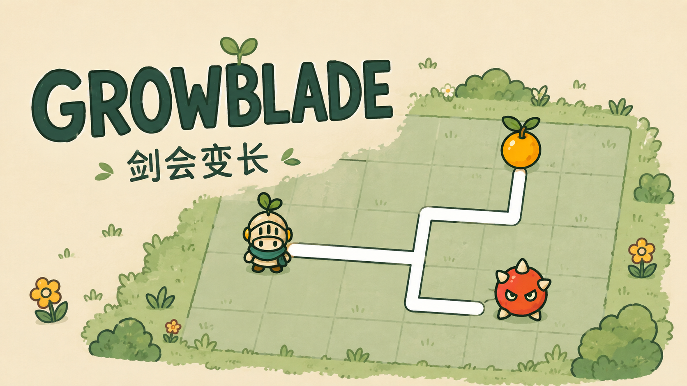
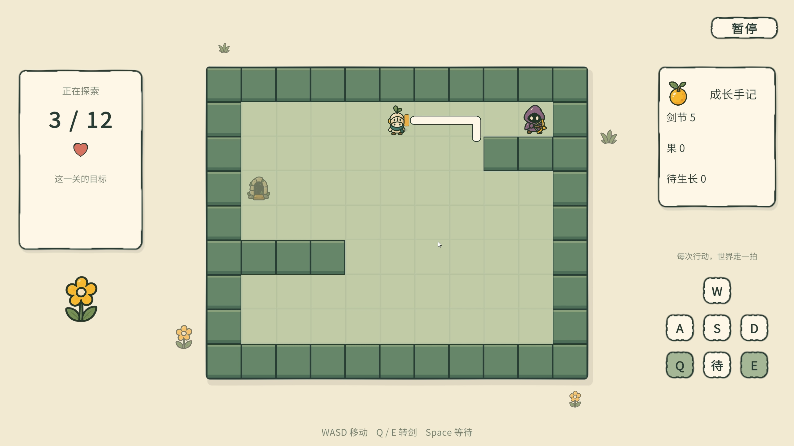
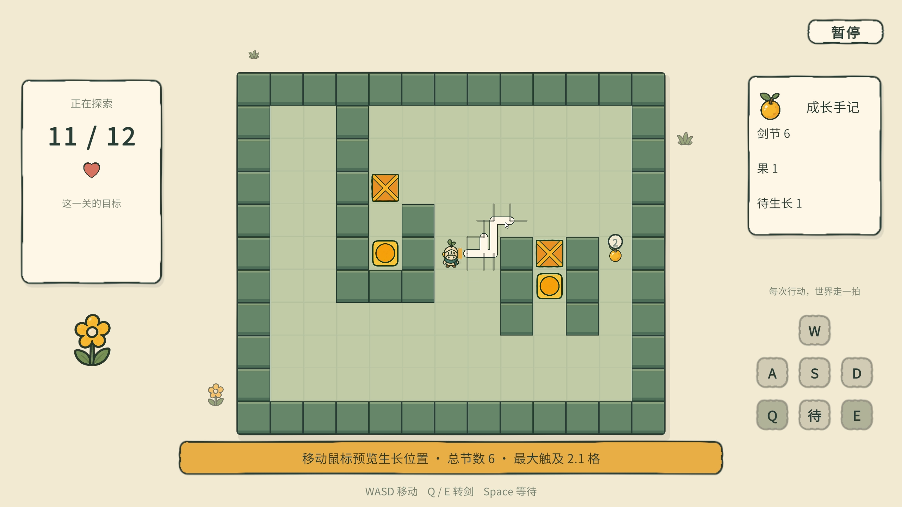

# Growblade / 剑会变长

**GameJam 发布版本：v1.12.0**
参赛项目：《GGJ翌光计划2026》
队伍：你说的队　作者：海蛋

《剑会变长》是一款 2D 俯视角同步回合制解谜游戏。玩家每行动一拍，敌人和机关也会推进一拍。吃到果实后，可以从任意剑身节点长出新的短节。更长的剑能攻击远处敌人、推动箱子，也会占据更多空间，让转身和穿过狭窄区域变得困难。

## 玩法亮点

- **自由塑造剑身：** 在任意合法节点增加固定长度的剑节，形成折角和分叉。
- **同步回合：** 移动、转剑和等待都会推进世界一拍，可以预判敌人的下一步。
- **空间解谜：** 剑既是武器，也是需要避开墙体的实体；成长会同时扩大能力和行动负担。
- **组合关卡：** 12 个短关卡逐步加入数字果、击退、弩手、箱子、压力机关和核心目标。

| 剑身塑形 | 推箱机关 |
| --- | --- |
|  |  |

## 操作

| 输入 | 行为 |
| --- | --- |
| W/A/S/D 或方向键 | 移动；受阻时前探回弹并经过一拍 |
| Q / E | 剑身逆时针 / 顺时针旋转 90° |
| Space | 等待一拍 |
| 鼠标左键 | 生长阶段确认新的剑节位置 |
| Esc | 暂停 |

## 下载与运行

从 [GitHub Releases](https://github.com/Hayden-Sea/GGJ_Growblade/releases) 下载 `Growblade-v1.12.0-GameJam-Windows.zip`，完整解压后运行 `Growblade.exe`。不要将 EXE 与 `Growblade_Data`、运行库分开。

## 从源码运行

1. 使用团结引擎 1.10.0（2022.3.62t12）打开项目。
2. 打开 `Assets/_Game/Scenes/Game.scene`。
3. 进入 Play Mode。

关卡编辑器入口：`Tools/剑会变长/Level Editor`。

## 文档

- [GameJam 发布说明](Assets/docs/gamejam-release-v1.12.0.md)
- [完整开发与规则文档](Assets/docs/sword-does-not-fit-development-tuanjie-1.10.0.md)
- [美术方向与接入说明](Assets/docs/art-direction-garden-v1.5.md)
- [音乐音效来源与授权](Assets/_Game/Audio/THIRD_PARTY_AUDIO.md)
- [版本记录](CHANGELOG.md)

## 授权

项目原创代码、文档和原创游戏内容采用 [CC BY-NC-SA 4.0](LICENSE.md)。第三方字体、音乐和音效保留各自授权，详情见开发文档与音频授权说明。
